# Lab1: Smart Lamp connection to Watson IoT Platform on IBM Cloud

## Introduction
These practical exercises are intended to illustrate the use of so-called 'intelligent' urban devices, which beyond their primary function, also include communication, telemetry and action capabilities.

## Description of hardware device
The equipment available represents in a reduced model what could be a 'Smart street street lamp'.

The device consists of a Raspberry Pi 3 minicomputer running a Linux flavor called Raspian based on the Debian distribution, to which an Arduino Uno microcontroller is connected via a serial over USB link (blue cable): 

The Raspberry Pi 3 is connected to the internet and the Cloud via a Wi-Fi connection, and will represent the heart of the intelligence of the communicating system: 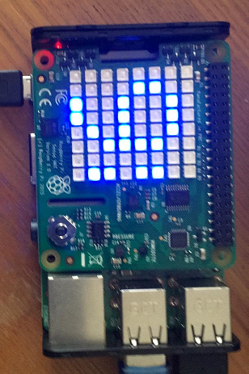

The Lamp devcice is powered by an Arduino Uno microcontroller unit, and is used to measure sensor values. It is equipped with an ambient light sensor implemented by a LDR (Light Dependent Resistor), a miniature solar panel, and an array of 5 LEDs located below the panel.

The raw sensor values are sent to the Raspberry Pi over the serial link. Commands from the Raspberry Pi are received by the device to set the LED lights values: 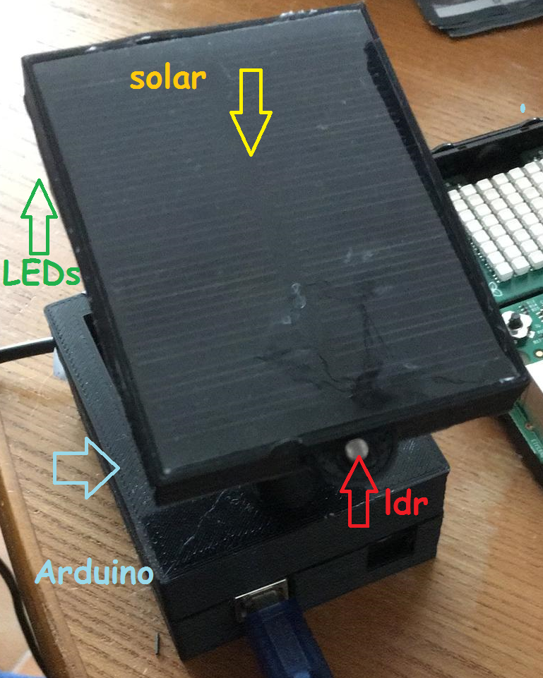

The primary function of the street lamp is of course to illuminate by means of a source of light, which will be simulated here by a bar of 5 controllable LEDs.

The Raspberry Pi itself has environmental sensors for temperature, pressure, humidity, whose values ​​are added to the payload of the lamp and sent to the cloud.

## Goal of the lab
The proposed exerices are intended to illustrate how an intelligent street light would behave, firstly to allow tracking of environmental data, but also to implement 'intelligent' behaviors via programmable automatisms, or to propose new functionalities.

## Organisation
The two first lab exercises are broken down into 6 sections:
  Lab 1.1. Getting started and simple connectivity to the cloud and plotting the data collected by the sensors.
  Lab 1.2. Create an account on the IBM Cloud Watson IoT platform.
  Lab 1.3. Connecting the SmartLamp to the IoT platform, defining and cataloging devices
  Lab 2.1. Create a Watson IoT dashboard to view the data.
  Lab 2.2. Creation of an interactive dashboard to control the lighting of the lamp.
  Lab 2.3. Creation of an automatic lamp control mechanism.

# 1. Getting started and connectivity
For the exercise, the lamps are connected on the internet via the Raspberry Pi.

A control software, called gateway runs on the Raspberry Pi and has the role of relaying the measurements taken by the sensors connected to the Arduino to the cloud.

This Control software is developed with a visual programming environment, Node-RED.

Node-RED can run on a variety of hardware types, from linux Single Board Computers such as Raspberry Pi to Cloud Environments.

The Node-RED program running on the gateway has been installed for you, but will require a configuration specific to your Cloud connection.

## Setting up the Node-RED gateway
### Accessing Raspberry's Node-RED
Node-RED is programmed through a web interface accessible from your laptops.

To get the IP adress of your Raspberry PI, click on the small joystick near the ethernet port. The IP address will scroll on the display.

Access your Raspberry Node-RED instance from your web browser using the on 1880 port i.e. http://Raspi_IP_Adress:1880/ 

### Configuring the gateway to send sensor's data on the cloud
The different tabs are programs (flows) that implement a functionality of the gateway. For example, the first tab, `SenseIP`, displays the IP address of the Raspberry on the LED display at system startup.

We will focus on the `Watson IoT` tab which is in charge of transmitting the sensor data to the Cloud: 

* Locate the `event` node at the top of the diagram, and double-click on it to open its parameters: 

* If not already done, select `Device` and `Quickstart`. An identifier must be filled in the `Quickstart Id` field. This identifier is used to recognize the different devices connecting to the Watson IoT platform on IBM Cloud.
NOTE: ___The QuickStart identifier must be unique___, so you may want to select e.g. `000000.XXXXXX` where `X` is the number of your Raspberry Pi as identifier.

* Click on `Done` and once back on the 'flow', on the `Deploy` button at the top right: 

* The status of the `event` node should indicate `connected` preceded by a green dot:


* We will now be able to view the sensor data on the test cloud environment. Reopen the properties of the `event` node by double-clicking on it and select the button to the right of the field `Quickstart Id` 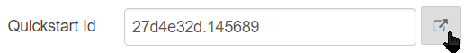. This opens a new tab where the sensor data is displayed:
  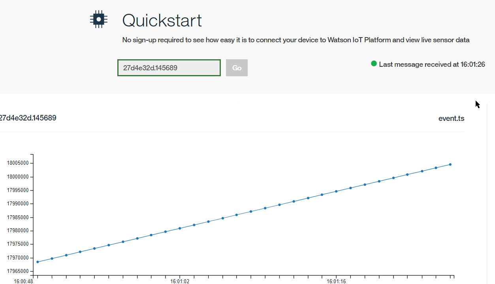

* The first field that is plotted is `ts` which is a record of time, so it is normal for it to evolve linearly.

* Navigate to the bottom of the screen and select another field, for example `solar` or `ldr`: the measurement graph is displayed and you can influence on the sensors (`ldr` or `solar` solar panel) by passing your hand in front to see the variation of the values on the graph.

  Raspberry equipped with a SenseHat (all except number 0) also have a record of temperature, humidity, pressure. One can act on the temperature or humidity by blowing on the sensors. 

* You can also access the plot from for example the browser of your mobile phone.

This illustrates how to connect a sensor to a cloud data collection system.   

## Control of the lamp LEDs from the Raspberry Pi
The Raspberry Pi has been set to send a lighting sequence to the lamp. We will first test this mechanism from Node-RED on the Raspberry Pi:

* Return to Raspberry Pi's Node-RED web interface, and navigate to the tab  `Arduino Streetlight`: 
* The sequence at the bottom of this flow makes it possible to send a command to the lamp. The lamp includes codes to light its various colors, R for Red, B for Blue, G for Green, 0 to 9 for various intensities of White, etc. Click on the pellet to the left of the button `RGBWOY`: 
* The lamp will light in sequence with the colors Red, Green, Blue, White, Orange, Yellow
* By double-clicking on the RGBWOY node, you can modify the parameters and the sequence that will be sent, for example `W9753RGB0`:  N'oubliez pas de validate the changes by clicking on the button `Deploy` 

# 2. IBM Watson & Cloud account creation Introduction
For the moment, we can only plot a few data points on a single sensor at a time, we will now set up a more specific system on IBM Cloud and Watson IoT allowing multiple values to be taken into account simultaneously and to compose a display more A privileged.

To do this, you must first register on the IBM cloud.

## Create an IBM Cloud Account
We will use the shortcuts provided in the screen `QuickStart`.

* Go back to https://quickstart.internetofthings.ibmcloud.com/#/device/27d4e32d.145689/sensor/ and click on the 'CREATE APP' button: 

* Click on the button `Sign up to Create` on the bottom right: 

* On the next screen, enter your email (or alias), Last Name, First Name and Password.

* IMPORTANT : Specify `United States` as country to be able to use beta features of IBM Cloud.
  

* Then click on  `Create Account` 

* 

* A confirmation email should be sent shortly, entitled `Action required: Confirm your IBM Cloud account`. Follow the instructions in this message to validate your account on IBM Cloud.

* After having confirmed the creation of the account, 
  proceed to login : 

## Creating a Watson IoT platform instance
From the home screen 
Click on 

In the filter field, type `iot`: 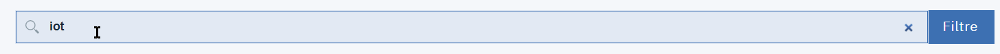
Then in the `Boilerplate`:


Choose a unique name, for example `guest1-raspi`, keep the default for the other fields

the clck on  `Create` 

Then wait for the platform to start

# 3. Connecting the SmartLamp to the Cloud Infrastructure
We will now connect the SmartLamp to the Watson IoT platform we created in the previous step.

To do this, we will change the login credentials on the Raspberry Pi, and create a definition for the SmartLamp in Watson IoT platform.

## Access to the Watson IoT platform
We will define the deivce type `SmartLamp` in Watson IoT so that we can then use it:

* In IBM Cloud, access the dashboard from the menu at the top left: ,   

* then select `Dashboard`: 

* locate the Internet of Thing platform service:  and select it

* On next screen, click on  `Launch`: 

You should arrive on the management console of your Watson IoT Plateform:
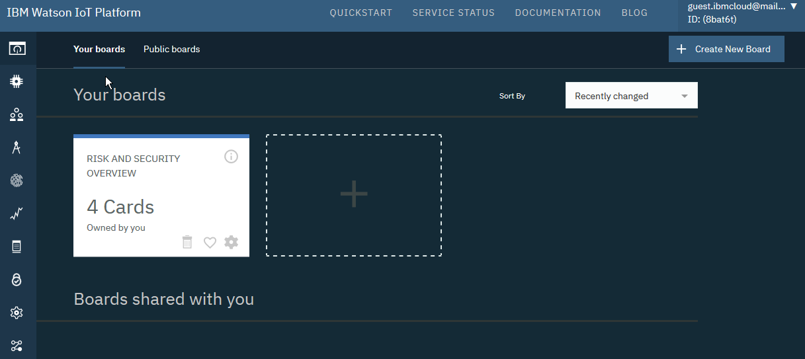

## Changing security settings
As this is an exercise, we will allow a simpler configuration of the security requirements of the terminals, by disabling the obligation to have SSL encrypted communications.

* Select  `Security` entry in the menu 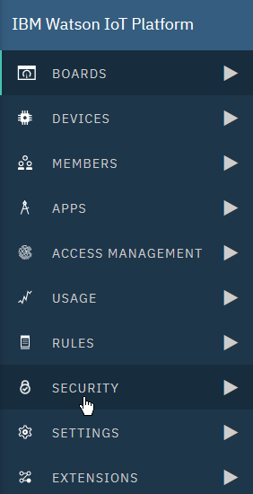

* Edit Connection Security parameters: 

* Select `TLS Optional` in the security level for scope `default `   

Click on OK on the Warning message And on the `Save`  button located at the top right postion 

## Creating the lamp definition
The lamp sends structured data in a JSON format with attributes corresponding to the values recorded by the various sensors.

Here we will only have one system, but in a real deployment, there may be many different types of hardware (called devices), and you have to tell the cloud platform what these devices are to be able to manage them according to their type.

* Access the terminal management menu: 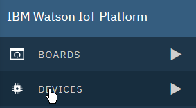

* There is normally no terminal defined at this point, click on `Add Device` button on the top right position  to add a new device 

* Select  `Device Types` tab , then `Add Device Type` 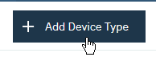

* Enter device type name `RaspiLamp`, and an optional description: , then on the `Next`  button.

* You can optionnaly add information on the  `Device Information ` tab and validate by pushing the `Done` on the bottom right 

* On the next screnn, select `Register Divces`, then enter `RaspiLampX` as name where  `X` is the number of your lamp., then push the `Next` button.

* Click`Next` until  `Security` tab, in the  `Authentication Token`, enter a value that you can easily remember such as the same name as your lamp, i.e. `RaspiLampX`: 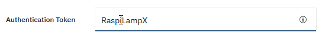 
  This token is in fact the password of the terminal and will be used to connect it to the platform in a secure way.

* Click`Next`until the last page and then `Done`  
  Please take note of your Organization ID :

  

## Registration of your streetlamp on your Watson IoT organization 
We will now modify the characteristics of the lamp connection in the Raspberry Pi to connect to this organization and to use the lamp data.

### Configuring data collection to Watson IoT
* Switch to another tab or window of your browser on the Node-RED interface of your lamp at the address 

  (Remember : To get the IP adress of your Raspberry PI, click on the small joystick near the ethernet port. The IP address will scroll on the display)

  Access your Raspberry Node-RED instance from your web browser on 1880 port i.e. `http://<<YOUR-IP-ADDRESS>>:1880/`

* Select `Watson IoT` tab the open `event` node properties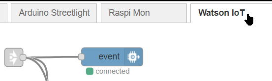

* Check that `Connect as` is set as `Device`, and select the radio button `Registered` 

* The next line changes to  `Credentials`, and click on the edit button on the right  and enter connection parameters of your lamp (Organization, Device Type, Device ID and Auth Token)
  

  then click the `Add` button on the top right

* Click on `Done` 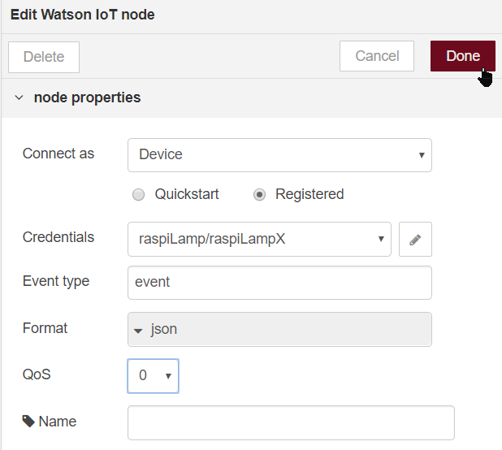   
  then click on  `Deploy` for the changes to be taken into account.

* The dot color of the node should briefly turn yellow or green, then go green: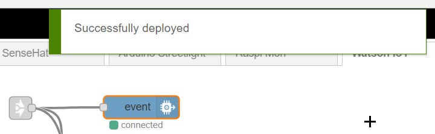
  The new lamp is now connected

### Configuring reception of commands
In the same way, we will reparametrer the node which receives the commands of the platform Cloud Watson IoT.

* Open the properties of the node`all commands` 

* Change `Conect as` to `Device` and select the credentials from the menu: 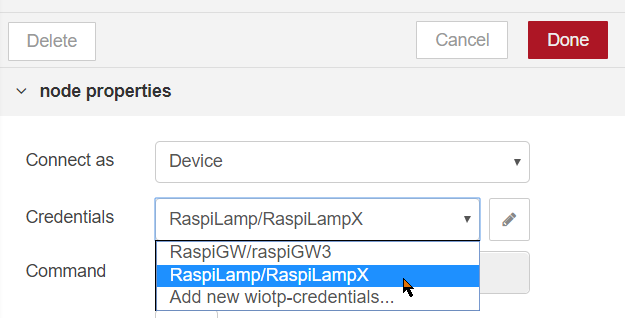
then click on `Done`

* After clicking on `Deploy`, the node dot goes red and then green

### Verification on the Watson IoT platform
* Return to the Watson IoT tab, select `Devices`  

  the line of the lamp must have a green dot on the left: 

* Selecting the `RaspiLampX` line the  `Recent Events` tab, we see the data arrive:
* 

### Definition of a device data type
Now that the sensor is plugged in, we will be able to introspect it to know its data format

* Return to the  `Devices` section, then select the type RaspiLamp and finally the tab `Interface` 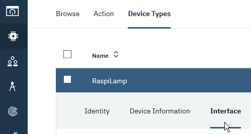

* Select`Create Interface` , the events that have arrived make it possible to know which attributes exist, then`Add Property` 

* Select `d`  and then `Next`

* Finaly the `Add` button: , and then validate by pushing `Done` 

# 4. Configuring historical Data Storage
Watson IoT Platform has a built-in mechanism to automatically store the incoming device data to No-SQL Storage in a Cloudant DataBase.

A Cloudant DataBase has been setup as part of the IoT Boilerplate creation. It is used to store the Node-RED configuration and flows.   
We will now configure Watson IoT platform to also store the device payloads.

We enable this feature as early as possible in the day so that we will have enough collected data for use in the Analytics Labs later on.

Switch back to the Watson IoT platform management interface
* Select the `Extensions` tab in the left-side menu: 
* Click `[Setup]` button in the Historical Data Storage pane: 
* Select the existing Cloudant service instance 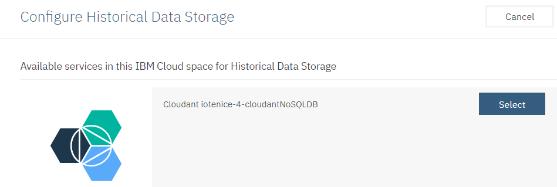
* On the next panel, you can select the Bucket Interval, which determines how often the name of the storage database is rolled over. For this lab you may choose any one of the options, e.g. `Month`. You can leave the database name to `default`, then click `[Done]`:  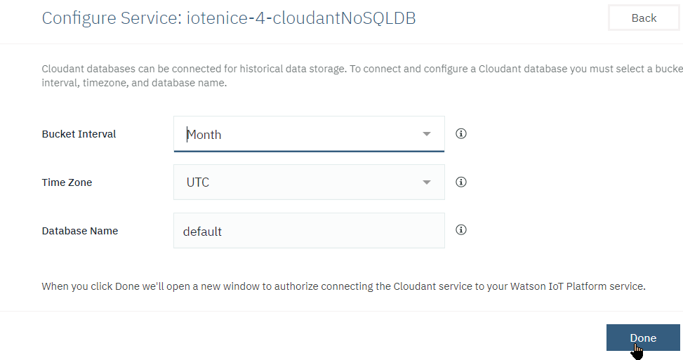

* Note: as mentioned, 'When you click Done we'll open a new window to authorize connecting the Cloudant service to your Watson IoT Platform service.', so the connection to Cloudant is validated in a Pop-Up window, make sure you display and validate this pop-up. If you have popup disabled in your browser, it may show up elsewhere on the browser page, e.g. for Chrome in the top bar as 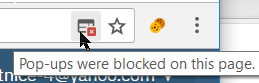   
Make sure you validate the pop-up!:
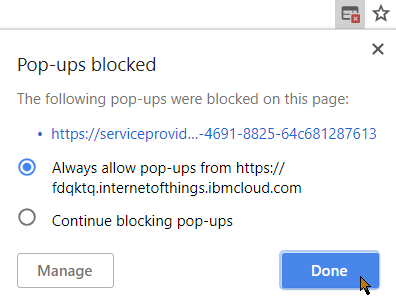, you should go through this window at some point: 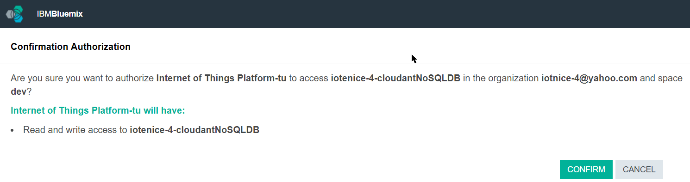
* Check that data is logged into the Cloudant DB
* Confirm the connection with the `[Confirm]` button, and verify that the status is now confirmed, such as: 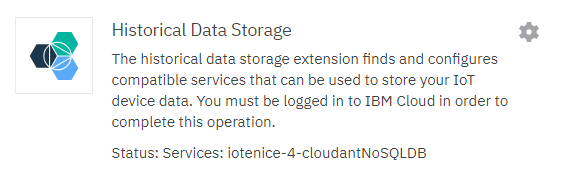

Since the device is sending data, storing into Cloudant should start immediatelly. We can verify this by looking into the Cloudant Database:
* Go back to the IBM Cloud dashboard: 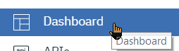
* Locate the Cloudant service and select it, then click the `[Launch]` button 
* You are taken to the Cloudant management interface. Select the databases icon 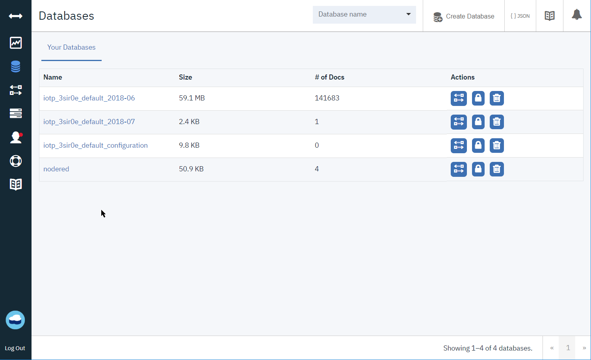. You should be seeing a list of databases, of which the Node-RED storage, and your device storage bucket DB:
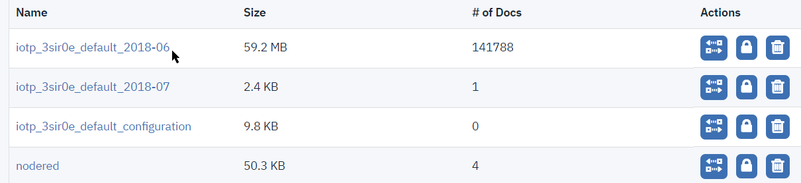
* Select the database bucket for the current month, you will see your documents, one row for each sensor value. Select one of the rows to see the values.
* We will add a search index to yield sensor data directly. On the `search` index, select the menu and `clone`: 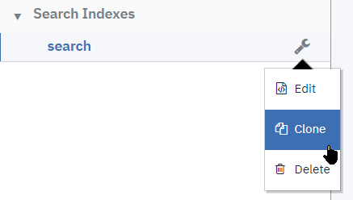
* use `searchdata` as name: 
* Edit the newly created cone index: 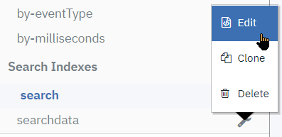
* Change the function to return only `sort`, `deviceId`, `timestamp` and then `ldr`, `solar`, `ts` renamed to `dts`, `temp`, `rawTemp`, `humidity`, `temperature`, `pressure`:
``` javascript
function (doc) {
  if (doc.deviceType && doc.deviceId && doc.eventType && doc.timestamp && doc.data) {
    index("sort", Math.random(), {"store": true});
    index("deviceId", doc.deviceId, {"store": true});
    index("timestamp", doc.timestamp, {"store": true});
    index("ldr", doc.data.d.ldr, {"store": true, "facet":true});
    index("solar", doc.data.d.solar, {"store": true, "facet":true});
    index("dts", doc.data.d.ts, {"store": true});
    index("temp", doc.data.d.temp, {"store": true});
    index("rawTemp", doc.data.d.rawTemp, {"store": true});
    index("temperature", doc.data.d.temperature, {"store": true, "facet":true});
    index("humidity", doc.data.d.humidity, {"store": true, "facet":true});
    index("pressure", doc.data.d.pressure, {"store": true, "facet":true});
  }
}
```
Click  to store.
* Test the index by entering the `*:*` special query on your new `searchindex` index.
* You can also enter a query such as: `solar:234` or range: `ldr:[16 TO 54]`

Note: the historical data can be accessed from Node-RED using a Cloudant node and the search index.

# 5. Configuring the Raspberry Pi as a gateway
In the first section of the lab, we have configured the RaspBerryPi as a single Device.   
It could be configured as a Gateway, which would then send sensor data on behalf of devices.

You can optionally do this now, the steps would be:
* Create a new Gateway type, e.g. `RaspiGateway`
* Create a `RaspiGatewayX` instance (use the deviceId as password)
* Modify the Node-RED flow on the RaspBerryPi so that the device connection type is now Gateway. Modify both the WIoTP in and out nodes.
* The gateway will now send the data on behalf of the device.

# Conclusion
We have now completed the first Lab and setup IoT Data Collection, we will now be able to build data visualization and further analytics.
