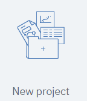
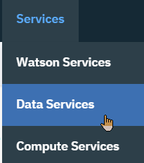
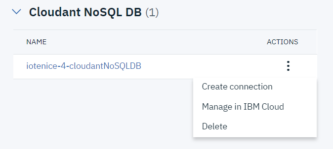
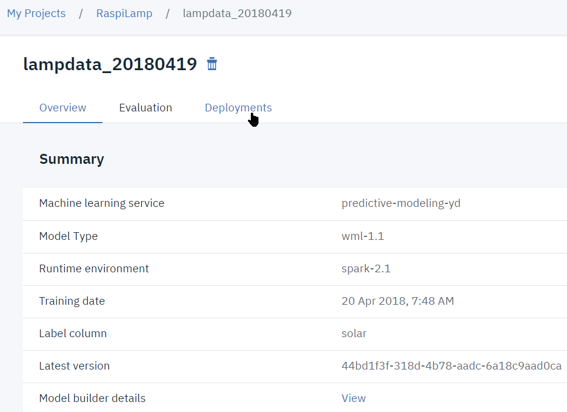

# Analyzing IoT Data with Watson Studio
In this section of the hands-on, we will use `Watson Studio`, IBM's Cloud Data Science and AI platform, to analyze the data gathered by the sensors on the RaspiLamp.

NOTE: for this section of the lab, each participant can proceed on its own and share the Watson IoT credentials from one of the Lamps.
It is even possible to share access of the Watson IoT administration platform's organisation, which could simplify cut&paste of credentials.
Note that in this sharing case, each connection to the platform shold use its own API key.

## [A] Create an IBM Watson Studio instance
IBM Watson Studio operates within the IBM Cloud environment, adding Data Science capabilities and leveraging the PaaS services.

* Switch to your IBM Cloud dashboard at https://console.bluemix.net/dashboard/apps
* Select `Create Resource` button 
* Type `watson studio` in the filter area 
* Select the `Watson Studio` tab 
*********
* Make sure you are in the same region as your Watson IoT Platform service.
*********

* The Lite plan should be selected by default, you may change the service instance name if you wish, then click `Create` 
* On the next page, select `Get Started`, accept the default organization and space:    
Lite accounts can have only one organization anyhow. Click `Continue`
* Once the account is created, follow with `Get Started` button .
* A set of welcome wizards will show you around some features of the Watson Studio environment.

## [B] Setting up a Data Science project
Watson Studio is built around the concept of `Project`, which is a collection of Data Science resources used within the scope of a project.

We will now create a Project to support the operations required for our IoT Lamp data analysis.

* From the Watson Studio landing page, select the `New Project` icon 
* Although we will not use all of the features, for the sake of simplicity, we will use a `Complete Project`, configured will all the tools enabled, so select `Complete` and click `OK`: 
* Select any name of your choice for the project, e.g. `RaspiLamp`. 
* On the right side, make sure the storage service is selected as `IBM Cloud Object Storage`, and click the `Add` label 
* We will create an instance of Cloud Object Storage at this stage. Select the Lite plan and `Create` button: 
* Accept the default naming on the `Confirm Creation` panel, and click `Confirm`: 
* You are taken back to the Watson Studio project creation page, select the `Refresh` label , your newly created COS instance will be selected.
* Proceed to creation with the `Create` button at the bottom right .
* Your project is now created!

## [C] Setting up access to historical IoT Data Storagea
There are different ways to collect and store historical IoT sensor data:
* Recent data is stored to a live/hot No-SQL database in real-time. This is what 
* Long-term historical data storage can become massive. 
 
For the RaspiLamp, we have one sensor reading per second, the JSON raw format for the full data will amount to about 800 characters per reading.   
JSON format has the advantage of allowing variable schema for the data items, at the expense of verbosity, since each row repeats the data tags.   
In this respect, a fixed CSV format with just the `ts`, `dts`, `ldr`, `solar`, `leds`, `rawTemp`, `temp`, `temperature`, `humidity`, `pressure` attributes uses up about 70 bytes per reading, so it is more efficient for long-term storage but also imposes a fixed schema.

The data that we will use for this historical data analysis Lab has been converted to fixed-schema CSV files stored in Cloud Object Storage. These files have been generated by a Stream, configured to roll over the next file each 100 readings, yielding a size of about 6.5k per file.

### [C.1] Creating a connection to the Cloudant Data Service in Watson Studio
In order to conduct historical Data Analyis from a notebook environment, we will setup a connection to the Cloudant database.

* Select the Watson Studio `Services/Data Services` menu: 
* Make sure that the Cloudant Service is listed and that you have a reference to your instance. This is the instance that we had configured earlier for historical Data Storage of the Raspi Lamp sensor data.
* From the Cloudant database menu, select  `Create Connection`: 
* Validate the New Connection panel with defaults and select `[Create]`, then target type Project, and select the RaspiLamp project that you created in the previous section.

### [C.2] 

## [D] Historical IoT Data Analysis using a Jupyter Notebook
For this section of the lab, you will first work with IoT raspiLamp data which have been collected over a longer period of time than the lab time span would allow.

We will show how Jupyter notebooks, which are 'live' Data Science environments based on Python can be used to conduct investigation and analysis on sensor data.

### [D.1] Create a notebook in Watson Studio
We will start by creating a notebook from an existing source which has been prepared in advance for you.   
You will then execute the notebook actions interactively.

* Switch back to Watson Studio and your RaspiLamp project, and from the `Assets` tab, select `New Notebook`; 

* We have prepared a notebook for use here, which can be found in the box folder at https://ibm.box.com/v/devoxxiotlab/RaspiLamp1_IoT_Exploration.ipynb Download it to your laptop
* In the new notebook creation, select the `From File` tab 
* Load the `RaspiLamp_IoT_Exploration_Cloudant.ipynb`, the name gets filled-in.

* Verify that the environment is `Default Anaconda Free` and click `Create Notebook`: 

The notebook's Python runtime environment will be launched,and you notebook ready for execution.

This notebook is intended to be run in two passes, a first pass will use historical data which has been gathered earlier, while a second pass will operate on the data which is currently being collected by the WIoTP->COS Stream.

Now follow the instructions in the notebook itself.

At the end of the second pass of the notebook, you will return to the instructions below to use the LampData file to run through Watson Machine Learning.

# [E] Machine Learning 
* Create a new model 

* Use any name, e.g. RaspiLampSolar 
* Create a ML Service instance 
* Chose Lite plan: 
* Click `[Create]`,then `[Confirm]` defaults
* Click `reload` and select the newly created service

* Similarly, create a Spark Service: 

* Select Lite plan and click `[Create]`: 
* Then in next panel `[Confim]` with defaults
* Back to the model creation panel, `Reload` and select the newly created Spark engine
* Select `Manual` model creation and click `[Create]`  

* On the next page, click `(+) Add Data Asset` 

* There are ways to reference existing object storage files in a project's environment (using the `project-lib` library re: https://datascience.ibm.com/docs/content/analyze-data/project-lib-python.html), here we will simply download the `lampdata_All.csv` from object storage and upload it back to the project's file. Right click the `Services/Data Services` menu to open in a new tab: 
* Select and open your `cloud-object-storage-*` service, then click on `Manage` in the menu on the left.
* Navigate to the `raspilamp-20180420-x` bucket and open it.

* Type `lampdata_All` in the filter field, and then download the file to your laptop: .

* Back to the model creation page, open the files drawer on the right, and select the `Load` tab 

* Drop the `lampdata_All.csv` file there and wait for it to be uploaded 

* Once done, select the file and click `[Next]`: 
* If you are prompted to provision a new kernel, accept and proceed

* In the `Select a technique` screen, select `solar` as the value to predict, `ldr` as a feature column, Regression as the technique and click the `(+) Add Estimator`: 

* Select and add `Isotonic Regression`: 

* Keep the 60-20-20 split of train/test/holdout, and click `[Next]`

* The model will start training, after a while you will be prompted to save it, acknowledge and proceed.

* Now switch to the `Deployments` tab:

* Click `(+) Add Deployment`: 

* We will add a Web Service deployment which will expose a REST API for scoring. Name it e.g. `WS_raspilamp` and click `[Save]`: 

* Once deployed select View from the Actions menu: 

* Switch to the `Test` tab, enter values (all zeros except for the `ldr` which should be in the 0-1023 range), and click `[Predict]`: 
* The predicted value for `solar` will be displayed

This concludes the scripted part of the Hands-On Lab

# [Z] Hands-on Stretch Targets
The following suggestions to go beyond are not scripted and left to your creativity in terms of implementation:

1 Generate data from the lamp with anomalies, e.g. points where `LDR` and `solar` do not receive the same light and thus are not on the curve.
2. Use clustering technique to classify the dots as normal or anomalous
3. Export this to a file with the class column
4. Train a model to predict the class from the ('ldr','solar') value
5. Use the python REST invocation API of the deployed service from a Notebook to score the contents of a CSV file.
6. Add this to the Streams flow to classify anomalies in real time
