# Analyzing IoT Data with Watson Studio
In this section of the hands-on, we will use `Watson Studio`, IBM's Cloud Data Science and AI platform, to analyze the data gathered by the sensors on the RaspiLamp.

NOTE: for this section of the lab, each participant can proceed on its own and share the Watson IoT credentials from one of the Lamps.
It is even possible to share access of the Watson IoT administration platform's organisation, which could simplify cut&paste of credentials.
Note that in this sharing case, each connection to the platform shold use its own API key.

## [A] Create an IBM Watson Studio instance
IBM Watson Studio operates within the IBM Cloud environment, adding Data Science capabilities and leveraging the PaaS services.
> You can skip this section if you already have a Watson Studio service defined and go to Section [B]

* Switch to your IBM Cloud dashboard at https://cloud.ibm.com/
* Select `Create Resource` button * 
* Type `watson studio` in the filter area 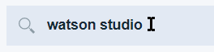
* Select the `Watson Studio` tab 
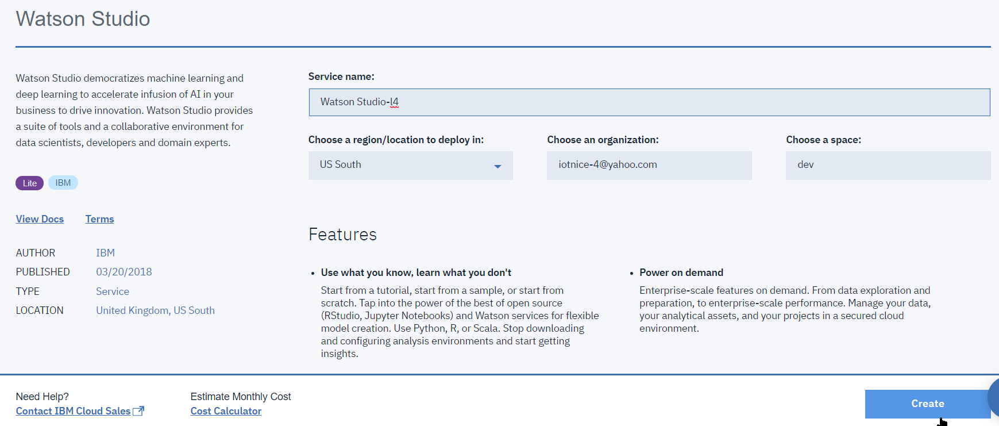
* The Lite plan should be selected by default, you may change the service instance name if youwish, then click `Create` 
* On the next page, select `Get Started` 
* Accept the default organization and space 
. Lite accounts can have only one organization anyhow. Click `Continue`
* Once the account is created, follow with `Get Started` button.
* A set of welcome wizards will show you around some features of the Watson Studio environment.

## [B] Setting up a Data Science project
Watson Studio is built around the concept of `Project`, which is a collection of Data Science resources used within the scope of a project.

We will now create a Project to support the operations required for our IoT Lamp data analysis.

* From the Watson Studio landing page, select the `Create a Project` tile 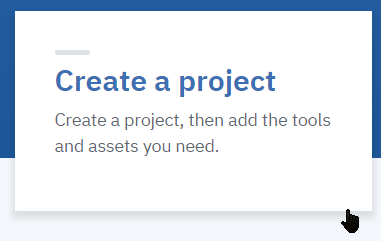
* We will use create a regular empty project 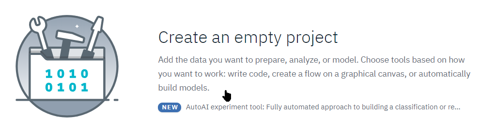

* Select any name of your choice for the project, e.g. `RaspiLamp`. 

* On the right side, make sure a storage service is selected 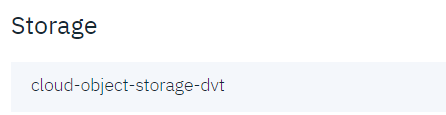
* If this is your first project, you will need to create an instance of Cloud Object Storage at this stage. Select the Lite plan and `Create` button: 

* Accept the default naming on the `Confirm Creation` panel, and click `Confirm`: 

* You are taken back to the Watson Studio project creation page, select the `Refresh` label , your newly created COS instance will be selected.
* Proceed to creation with the `Create` button at the bottom right .
* Your project is now created

## [C] Setting up a stream flow to store IoT Data to Cloud Object Storage

### [C.1] Creating the flow artifact
We will now create a streaming data flow which will collect data sent by the Lamp through Watson IoT Platform and store it in Cloud Object Storage

* From the `[(+)Add to project]` button, select the Streams flow tile 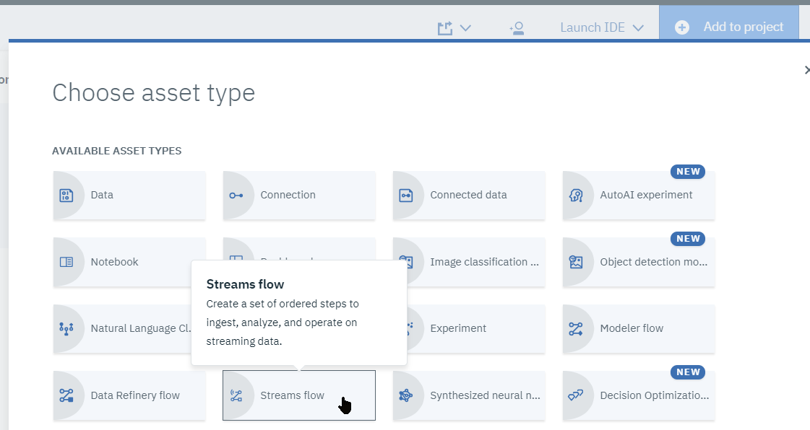
* Type a name, e.g. `RaspiLampFlow`

* Create a streaming analytics service in IBM Cloud PaaS by clicking on `Associate an IBM Streaming Analytics instance` 

* Select the `Lite` plan 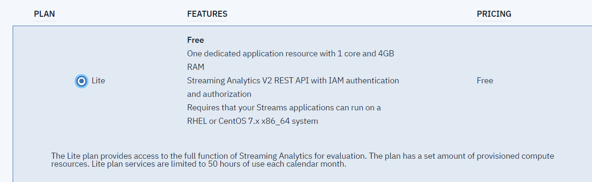 and click `Create`

* On the confirm screen, accept the defaults and `Confirm` 

* After the service is created, you will be getting back to the creation pane, make sure your new service is selected, select the `Manual` option and click `Create`: 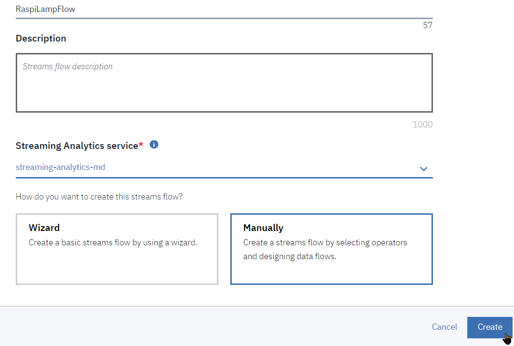

* You will then be taken to the `Streams Designer` cloud-based web tool.

### [C.2] Preparing to implement the WIoT to COS flow
For the sake of the exercise, which can collect data only for a limited time, we will configure a flow that will collect data from the RaspiLamp and store the values to a new Cloud Object Storage file every 2 minutes. We will show basic flow data structure handling capabilities by adding an absolute timestamp to the payload, since the RaspiLamp device currently sends only device-relative timestamps, in the `ts` field.

* First we will need to setup and gather endpoint and credentials information for the source (Waston IoT Platform) and target (Cloud Object Storage) of the stream.

* Switch back to the Watson IoT platform web interface (http://**_abc123_**.internetofthings.ibmcloud.com), where **_abc123_** is your Watson IoT platform organization ID, and select the `Apps` menu: 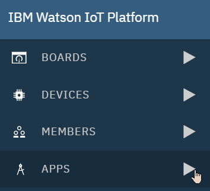

NOTE: if you are sharing access to a lamp, each connection should generate its own API Key.

* Click on `Generate API Key` 

* Enter a description and click `Next`: 
* Select a role of `Data Processor application`, which gives access to the data from devices but not to platform management capabilities, and click `Generate Key`: 

* On the next page, **Make sure you write down** the API Key and especially the **_Authentication Token_**, which cannot be retrieved afterwards (best is also to keep the the tab opened): 

* We now need to get the Cloud Object Storage credentials. Switch back to the Watson Studio tab in your browser (https://dataplatform.ibm.com), right-click on the `Data Services` from the `Services` menu, and open in a new tab: 
* In that new tab, click and select your COS instance: 

* This opens the COS instance management panel in a new tab, select `Manage` from the menu on the right, then `Create Bucket`; 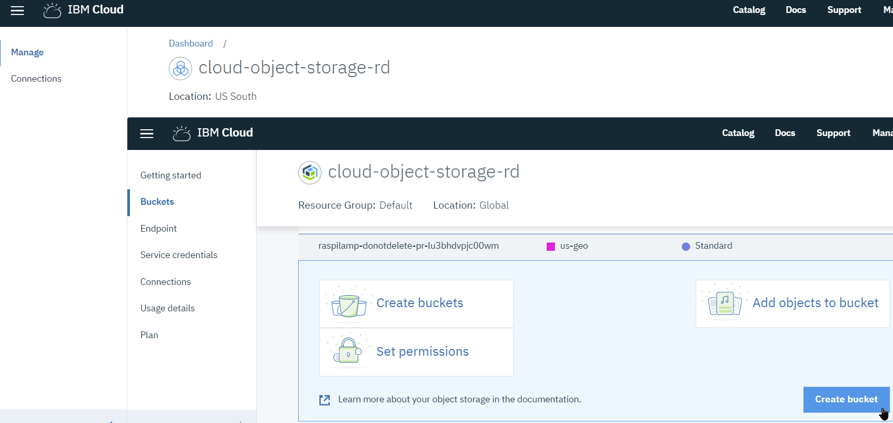

* In COS, a bucket can be assimilated to a root-level directory. Those names need to be globally unique, so we will use a name made up of a prefix, the currenyt date and a suffix that matches your lamp's number, name the new bucket e.g. `raspilamp-20190912-x` where `x` is you lamp number, and keep the other defaults: 

* Add credentials for use by our stream. Switch to the `Service credentials` tab and click `New credential`: 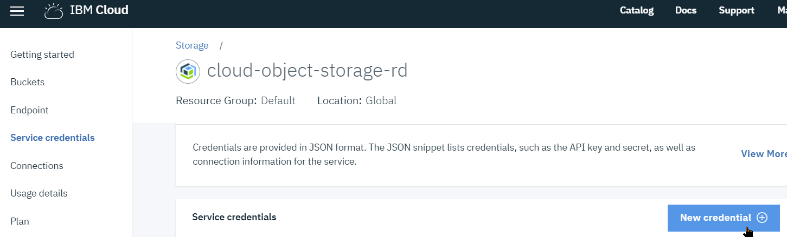

* You may keep the default name, make sure the access is set to `Writer` and click `Add`: 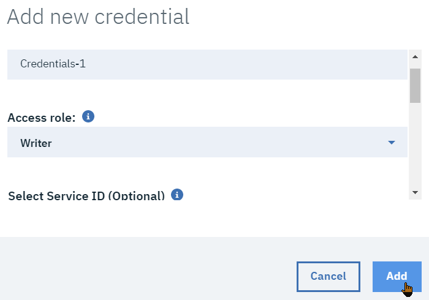.

* Expand the newly created credentials JSON and keep this tab opened: 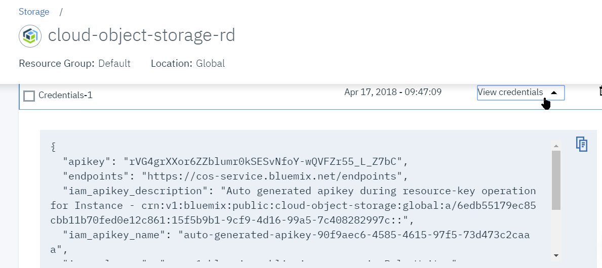

### [C.3] Implementing the WIoT to COS flows
We are now ready to actually implement the flow.

* Switch back to the browser tab where you have the flow editor opened
* From the `NODES SOURCES` palette, drag and drop a Watson ioT node onto the canvas: 

* Once dropped, click on `Add Connection`; 

* Give it a name, e.g. `RaspiLamp`, and paste your WIoTP organisation ID, API Key and authentication token (note that the OrgID is the 6-character ID present in the API key after the `a-``), then click `Create`: 

* The connection parameters open themselves on the right. The + for `DeviceType`, `DeviceID` and `Event` means that we will subscribe on everything. You may want to filter by DeviceType `RaspiLamp` for example. Click on the `Edit output schema` link: 

* This section will listen to the dataflow coming from the device and introspect the data schema, click on `Detect Schema` button: 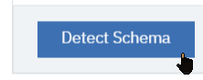

* You may expand  to have a look at the incoming data.

* Then click on `Apply` and then  `Close` to accept it: 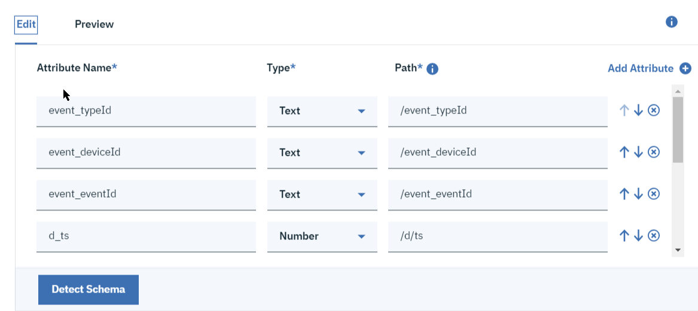

* Back to the canvas, drag and drop a `Cloud Object Storage` node on the canvas, from the TARGETS section: 

* Select `Add Connection`: 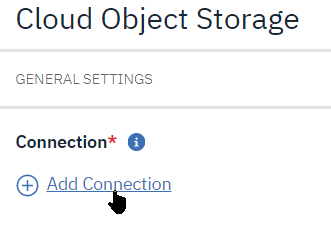
* Select your COS connection, which is known to the Watson Studio environment: 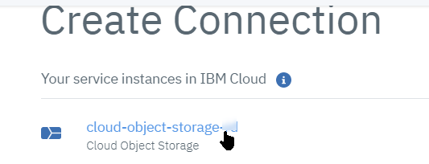

* You may leave the default connection credentials there, then click `Create`: 

* We will now rename the `ts` field to `dts` and add a new `ts` field that holds the current timestamp. From the `PROCESSING AND ANALYTICS` drawer (**NOT** the `TARGETS` drawer), drag&drop a `Code` node and wire it between the WIOT input and COS output nodes: 
* Lastly, modify the details of the file creation policy. We will generate CSV files with the write timestamp in the name, generated in the bucket we created earlier. Enter a `File path` of __`/raspilamp-20190912-x/lampdata_%TIME.csv`__. Then keep the default CSV file format, check the `Column header row` so that file contents keeps being identified, and enter a file creation policy based on time, every 120 seconds: 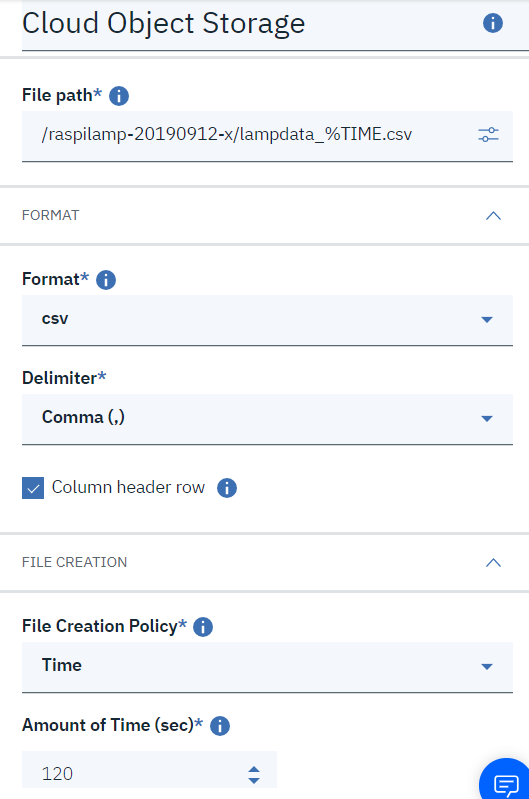

* Select the `Code` node and edit the output schema , click `Add Attribute`  then `use Incoming Schema`, and then add an attribute named `dts` of type `Number`, such as: 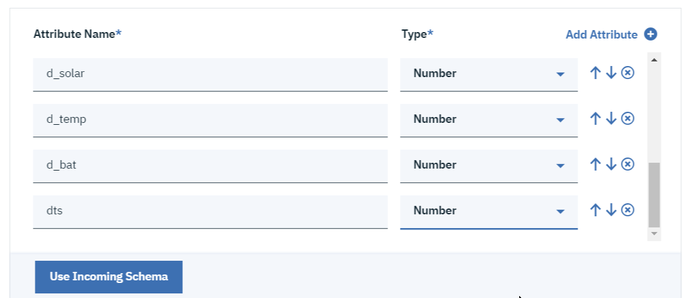, and click `Apply`
* Now edit the code so as to modify the `process` method as such:
``` python
  def process(event, state):
    # Enrich the event with absolute timestamp field
    import datetime
    event['dts']=event['d_ts']
    event['ts']=datetime.datetime.now().timestamp()
    return event
```
* The flow is now ready for deployment. Click on the `Save and Run` icon; 
You may have a notice to the effect that the streaming service is stopped, acknowlege the start of course: 

* After a while, the flow should be running and will animate when events are coming in: 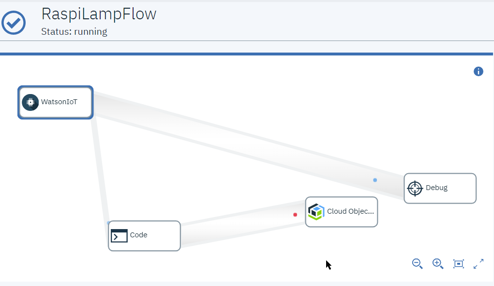
* You may want to switch to your COS service and check that some new filea are beeing created in the bucket: 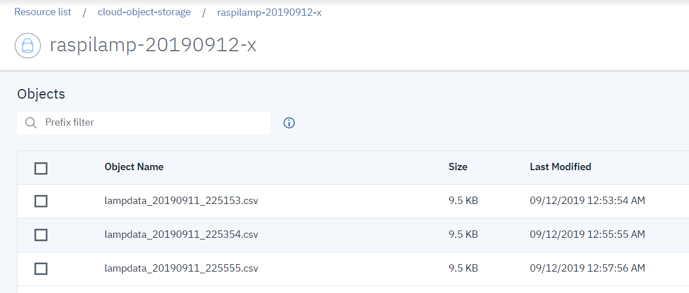

Note that here we just use a code node to do schema manipulation, and since we want to gather enough data in the short time we have, we don't do aggregation, but the primary role of a stream processing flow is to perform data aggregation to reduce the volume.

**Optional**: You may want to experiment adding an aggregation node that outputs to a second COS write out on a different file path pattern (still in the same bucket), and for example aggregate the `solar` and `ldr` attributes through averaging on a 60-second time window.

## [D] Historical IoT Data Analysis using a Jupyter Notebook
For this section of the lab, you will first work with IoT raspiLamp data which have been collected over a longer period of time than the lab time span would allow.

We will show how Jupyter notebooks, which are 'live' Data Science environments based on Python can be used to conduct investigation and analysis on sensor data.

### [D.1] Create a notebook in Watson Studio
We will start by creating a notebook from an existing source which has been prepared in advance for you.   
You will then execute the notebook actions interactively.

* Switch back to Watson Studio and your RaspiLamp project, and from the `Add to project` menu, select `Notebook`
* We have prepared a notebook for use here, which can be found in the box folder as `RaspiLamp1_IoT_Exploration.ipynb`.
* In the new notebook creation, select the `From File` tab 
* Load the `RaspiLamp_IoT_Exploration.ipynb`, the name gets filled-in.

* Verify that the environment is `Default Anaconda Free` and click `Create Notebook`: 

The notebook's Python runtime environment will be launched,and you notebook ready for execution.

This notebook is intended to be run in two passes, a first pass will use historical data which has been gathered earlier, while a second pass will operate on the data which is currently being collected by the WIoTP->COS Stream.

Now follow the instructions in the notebook itself.