# Connected Streetlight

## Bringing cognitive capabilities to the streetlight Hands-on Lab
This lab will show you how to enrich the application with cognitive capabilities that add a more natural and flexible way to interact with the lamp system.

You will learn how to add a conversational interface to the street light application. The purpose and scope of Watson Conversation is to facilitate implementation of natural language interaction between man and machine. In this case, between you and the streetlight. You will trigger the functionality that you build in the previous labs through a text-based dialog with the streetlight.

Once the technical layers are in place, Watson Conversation is designed to be modifiable by a power user with business skills rather than I/T personnel. For simplicity you will use Node-RED to build the technical layers, wiring Watson Conversation to actionable entities such as the lamp’s LED and sensors. The dialogue itself will be built using the Conversation building tool provided by IBM Cloud.

## A.	Setting up the technical layers
### 1.	Creating and binding the Watson Assistant service
To easily use the Watson Assistant service from Node-RED, you will link an instance of the service to the application running Node-RED.

* Navigate back to the IBM Cloud dashboard, and click the Create Resource button: 
* We will add a connection to an instance of the Watson Assistant service. Click the “Create Connection” button as shown above, type Assistant in the Search field, and select the Watson Assistant tile:
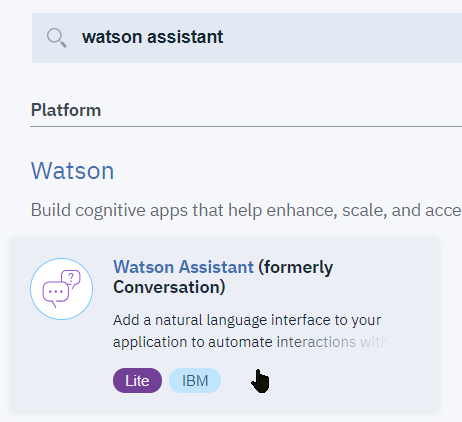
* Keep the defaults on the next page, and select Create 
* Once created, click the Connections tab on the left hand side, and then Create Connection: 
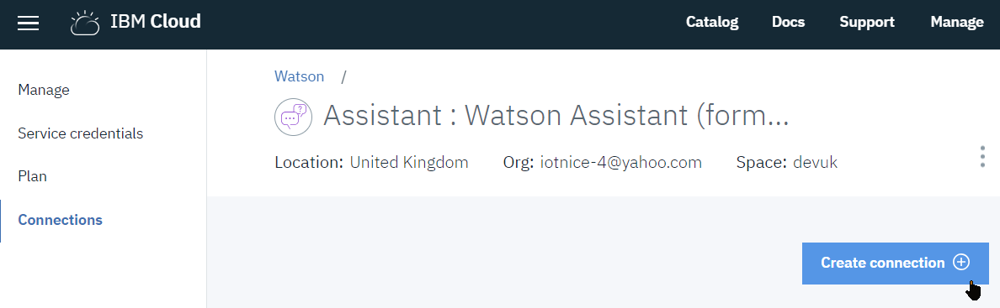
* Click the Connect button next to your Node-RED application:
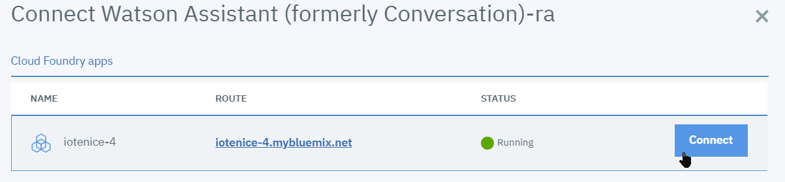
* You will be asked if you want to restage. Select Restage: 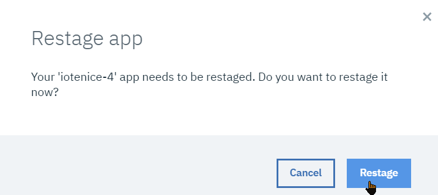
Once restarted, the Conversation service will be available to your Node-RED instance.

### B. Creating a test conversation from the sample
To get started with implementing a conversation, we will upload a prebuilt sample Conversation which was originally designed to control operations of a car's equipment.
* Switch back to the `manage` tab of your  Watson Assistant service, and click `[Launch Watson Assistant]` 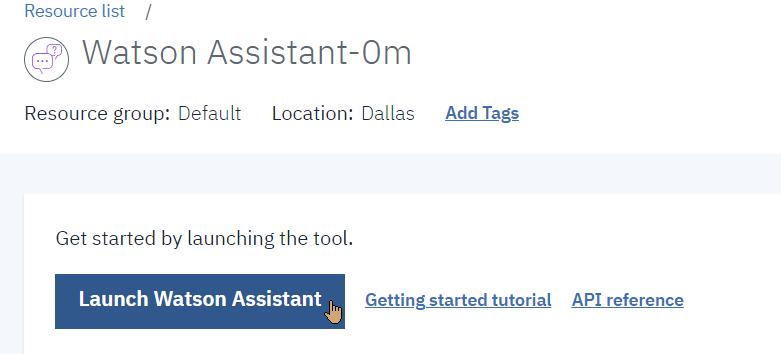
* Once on the tool page, select the `[Create assistant]` button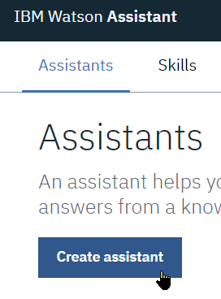
* Give it a name, e.g. `LampAssistant`, and proceed to creation 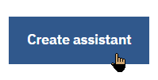
* Select the `[Add dialog skill]` button 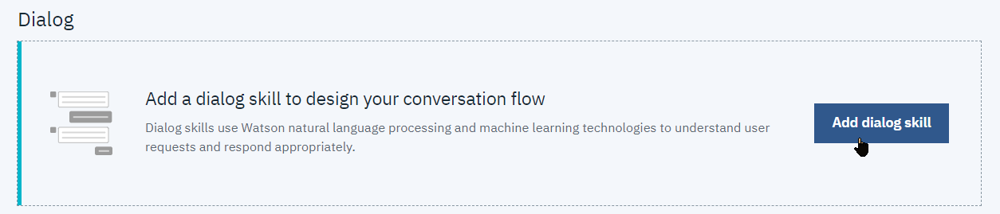
* From the Add Diloag skill page, switch to the Import skill tab 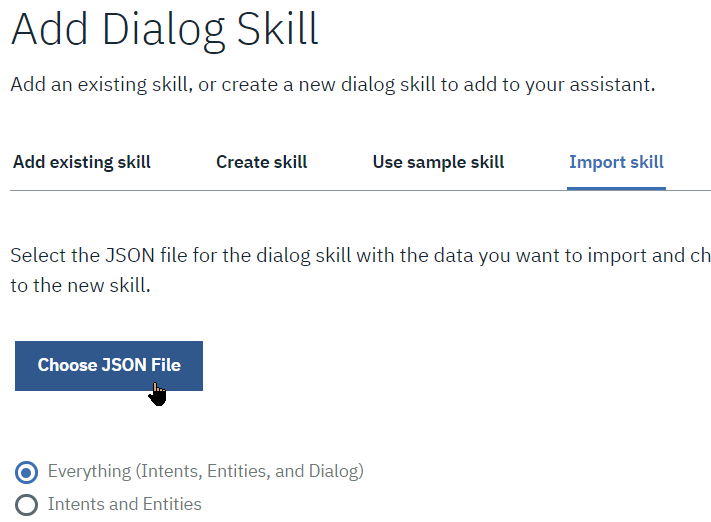 and click `[Chose JSON File]`
* Pick the `Lab5_Conversation_Car_Dashboard.json` file and click on the `[Import]` button 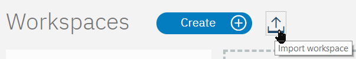
* Select `Lab5_Car_Dashboard.json` to import 
* Back to the LampAssistant page, open the **Car Dashboard - Sample** dialog
* Use the Try it button to test the dialog 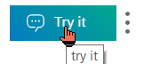
  * Enter a request such as "Turn on the light" or "Switch off the light"
  * Check in Manage context 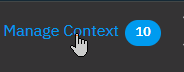 that the context variable `$lightonoff` changes state accordingly

### C. Set up the Web UI interface in Node-RED
* Switch back to your IBM Cloud Node-RED flow editor page. Create a new flow tab, double-click it to open the settings, and name it LampBot.
* From the palette, drag in HTTP Input, template and HTTP response nodes (tip: type http at the top of the nodes palette to quickly find the nodes) and wire them together.

* Open the http input node.  Set the method to GET, type `/lampbot` for the URL, and click Done 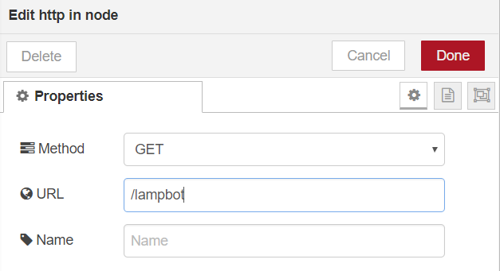.
* Open the template node and check that the selected format is Plain Text. Copy the code from the provided `LampBotUIPage.html` file. Then click Done.
  This code has been adapted from https://github.com/watson-developer-cloud/Node-RED-labs/tree/master/basic_examples/conversation. It provides a basic Web page as a front end to the chatbot. You may refer to the link for more detailed information about its exact functionality.
* Click on the `[Deploy]` button.
* Click the assistant's Settings menu 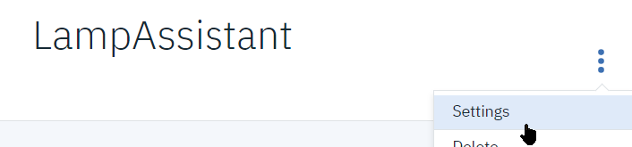
* From the *API Details* tab, make a note of the `Assistant ID` value.

### D. Create Conversation chat bot flow
* Create a second flow in the same flow, chaining an HTTP Input node, a function node, a Watson Assistant V2 node, another function node and an HTTP response node as per below 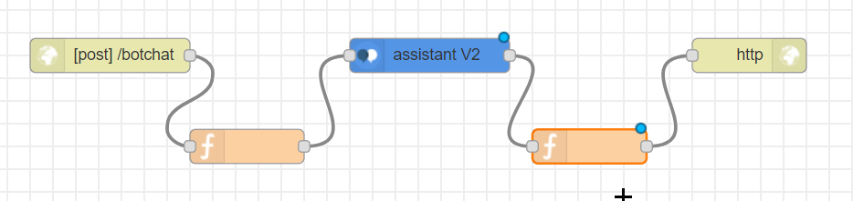
* Set the HTTP input node method to POST and its URL to `/botchat`
* Add the following code to the first function node:
``` javascript
// stash away incoming data
msg.mydata = {};
msg.mydata.messagein = msg.req.body.msgdata;
msg.payload = msg.mydata.messagein;

msg.params = { "context": msg.req.body.context};

return msg;
```
* And this code to the second function node:
``` javascript
msg.mydata.messageout = msg.payload;

msg.payload = {};
msg.payload.botresponse = msg.mydata;

return msg;
```
* This implements a REST service to call the conversation with some context. We will modify it later in order to control the lamp as well. Those interested in more detail can find it in GitHub.
* Finally, edit the Assistant V2 node. Enter the Assistant Name and ID that you saved earlier.

### E. Test the sample conversation from Node-RED
* Deploy the flow and open a separate tab in your browser pointing to the flow’s UI URL. Since you set the http input node’s URL to /lampbot, you will find the UI at https://streetlamp-xxx.mybluemix.net/lampbot.
* Start typing questions in the chat bot. Note that you need to click on the Send button rather than type enter to send information. You can enter requests such as Hello, switch on the light. You should see answers appear in the dialog.

### F. Make the conversation actionable
* We want the conversation to control the lamp. Since the sample conversation already has commands to set the state of lights, we will hook them up to our code that sends a command to the streetlamp.
* Switch back to your Streetlight flow, and locate the IBM IoT output node used to send the intensity to the lamp (in the `Set Light` flow). From the palette, add two input link and two change nodes. Wire them to the IoT output node as shown:
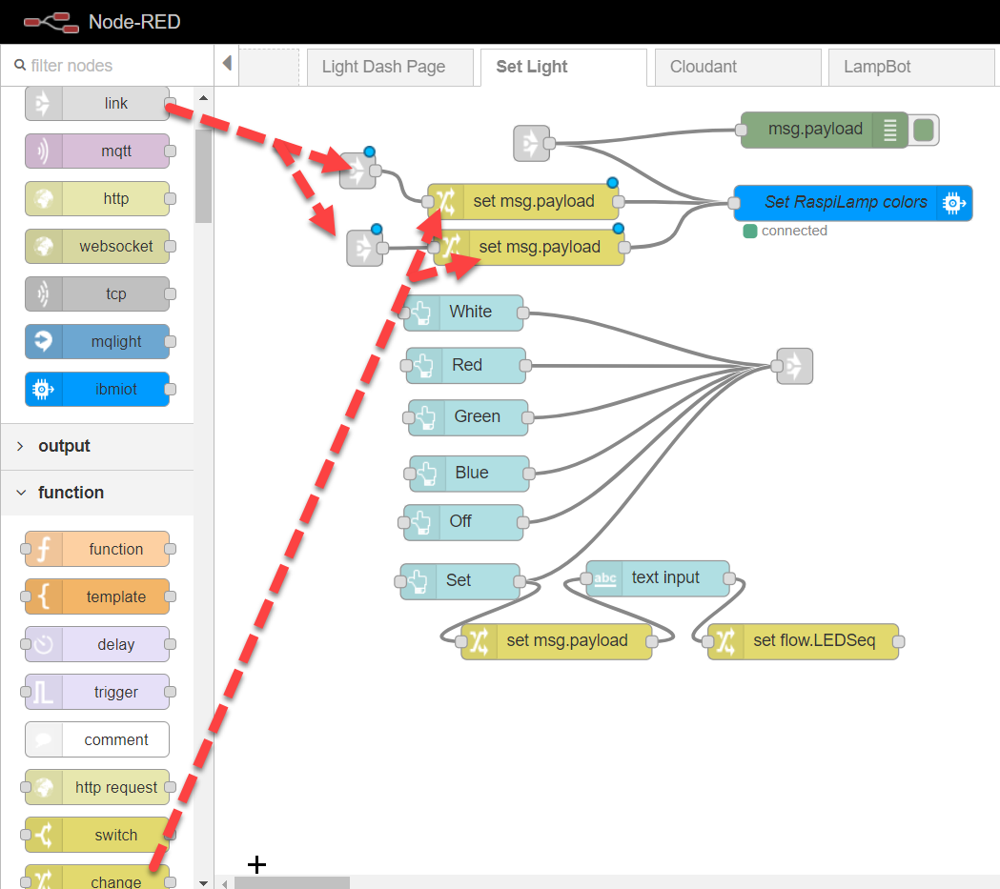
* Edit the two link nodes and name them Lamp On and Lamp Off respectively. The Link nodes will carry information from the LampBot flow to this one.	
* Edit the two Change nodes so that they set the msg.payload to numeric value 9 and 0 respectively: 
* Deploy the flow.
* Return to the LampBot flow editor. Add a Switch node and wire it to the output of the Conversation node. We will interpret the value of the Conversation’s lightonoff context parameter to set the lamp value accordingly. 
* Edit the switch node to add an additional output and trigger one when the value is the on string and the other when the value is the off string. This will create two outputs on the switch node. 
* Add two link output nodes, wire each one to an output of the switch node, then edit them and select the Lamp On and Lamp Off links from the Street Light Tab: 
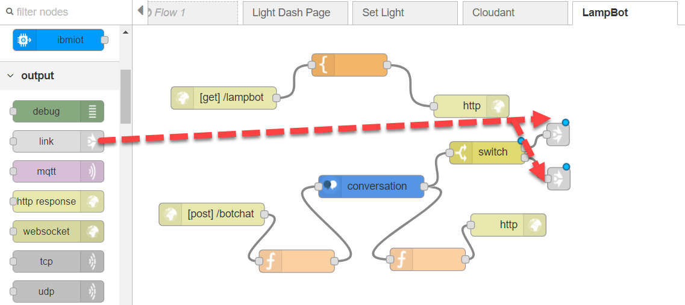
Deploy the flow.

### G. Test and enhance your chatbot
We will use the conversation dialog to change the state of the streetlight
1. Go back to the chatbot UI URL, and enter commands to control the light:
   * `Switch on the light`
   * `Switch off the light`
2. The initial on/off status of the lamp stored in the Conversation context is not necessarily aligned with the initial physical state, so you may have to enter the first command twice to align them. Since the Streetlight flow receives updated status from the lamp, you could enhance the flow by storing the status in the global context (using e.g. a switch node) and using it to align context prior to calling the Conversation.

### H. Evolve the Conversation by adding more understanding
1. You may have noticed that asking the LampBot to act on a ‘Lamp’ does not work. It currently only understands the term ‘Light’ because the sample was designed to control functions in a car. We will now complement the Conversation to add more understanding of urban fixtures.
2. Switch back to your IBM Cloud Services, locate the Conversation Service and launch the Conversation Tool. Edit the Car Dashboard sample.
3. Once there, select the Entities tab. An entity definition includes a set of entity values that can be used to trigger different responses. Each entity value can have multiple synonyms, which define different ways that the same value might be specified in user input. There will be an @appliance entry, with a lights instance, that we will adjust so that it also understands lamp. 
 
4. Click on `@appliance` and then click on lights. Click in the `Add synonyms` field and type `lamp`. Hit the return key to enter the value. . You may want to add other synonyms such as `street lamp` ,`street light`, `lamp pole`
5. Switch back to the chatbot UI, and enter a sentence such as turn on lamp to verify that the new synonym for light is now understood. When a new element is added to the Conversation model, the Conversation takes some time to train itself to understand it. If the new term does not work immediately, take a break for a couple of minutes and try again.

### I. Adding functionality to the Conversation
1. We will now modify the conversation so that it understands additional commands. The Conversation has a #information_request intent which currently works on time and date queries. We will extend it so that it can also reply with lamp readings.
2. In the Conversation tool, switch to the Intents tab.  Intents are purposes or goals expressed in a user’s input, such as answering a question or processing a bill payment. By recognizing the intent expressed in a user’s input, the Conversation service can choose the correct dialog flow for responding to it.
3. Locate the `#information_request` entry. Click on it and add the following user examples:
   *	What is the light output like?
   *	What is the lamp value?
   *  How much is the street light output? 

4. Click the back arrow and then switch to the Dialog tab. A dialog uses intents, entities, and context from your application to return a response to each user's input. We’ll add a response to return the state of the streetlight. Navigate to the node labelled `#information_request`. Expand it using the > and select the true box: 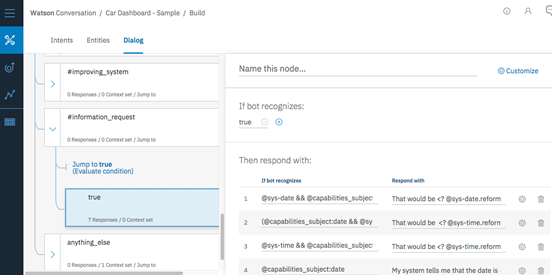
5. At the bottom of the Customize panel, choose Add response.
6. Use the up arrow to move it to the top of the list, then enter `@appliance:lights` in the first column and enter the response: `The light’s current solar reading is $d.solar` in the second column 
7. You can test this in your UI, or you can launch the Watson Conversation test facility with the  button on the top right. 
8. Try a question like ‘what is the light value?’ or variations such as ‘How much is the lamp output?’ You will begin to appreciate the power of a cognitive chatbot, which will accept variations of the questions outside of the exact wording provided.
9. Since we have not wired up the value, `$d.solar` will be displayed as text rather than replaced by its value. We will now make this value available to the Conversation by passing it in the context. 
10. Switch back to the Streetlight flow in Node-RED, and add a new change node, and wire it to the output of the IBM IoT input node. Edit the change node to set the `global.lampdata` variable to `msg.payload`, and redeploy the flow 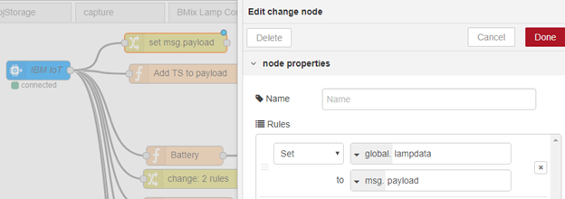
11. In the LampBot flow, edit the function node just before the conversation node, and set the code to add the value of global.lampdata to the context by changing the code to:
``` javascript
msg.mydata = {};
msg.mydata.messagein = msg.req.body.msgdata;
msg.payload = msg.mydata.messagein;

msg.params={};
if(msg.req.body.context) {
    msg.params.context = msg.req.body.context;
} else {
    msg.params.context={};
}
msg.params.context.d = global.get("lampdata").d;

return msg; 
```

12. Deploy and check that when you ask the LampBot ‘What is the lamp value?’, or ‘How much is the lamp output?’, Watson Assistant will tell you the solar panel's latest value.