# Lab 2: Smart Lamp data visualization with Watson IoT Platform on IBM Cloud

## Introduction
In this lab, we will use two different techniques to visualize the IoT sensor data collected on the Watson IoT platform.

We will first use the real-time insights dashboard provided by the platform, and then use an external application, in this case Node-RED running as a Cloud Foundry application on the IBM Cloud.

### Prerequisite
This lab assumes that the RaspiLamp types, schemas and devices of Lab 1 have been setup.

# 1. Creating a dashboard on Watson IoT Platform
We will now create a graphical interface to plot the data of the various sensors of the lamp.

* Select  `Dashboard` menu 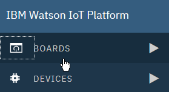
* Click on the big empty rectangle to add a table 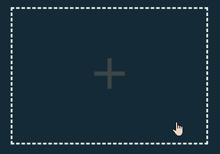
* remplir les données 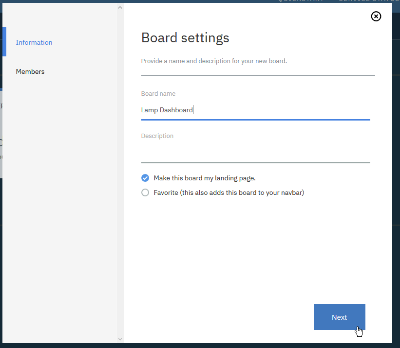   
  then `Next` and `Submit`

* Open the newly created table: 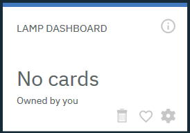

* Click `Add New Card` to add items to the table 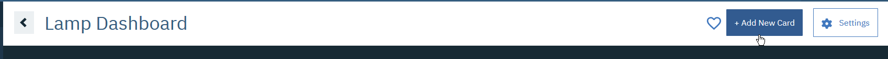

### Adding a gauge
* For example, add a brightness gauge 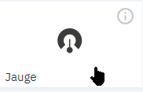
* 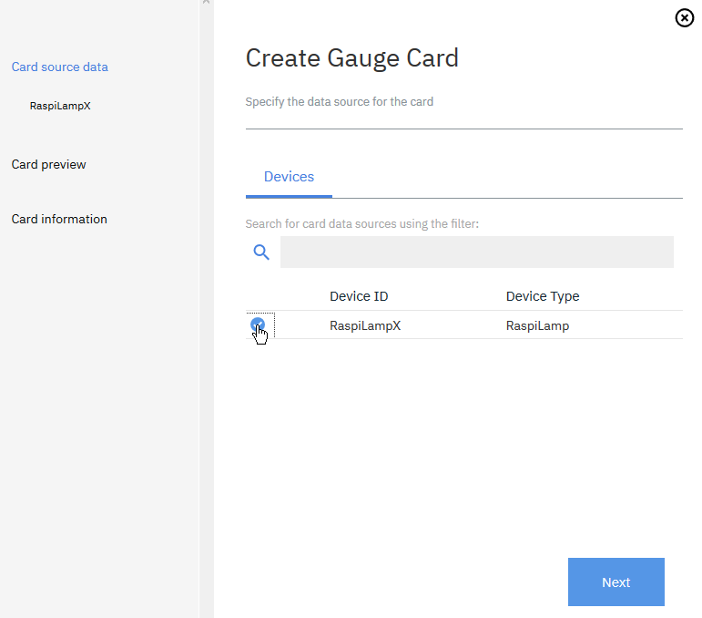
* 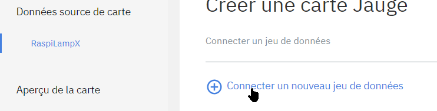
* 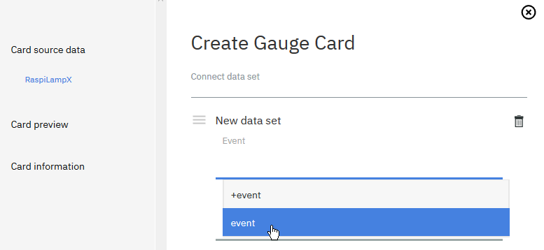
* 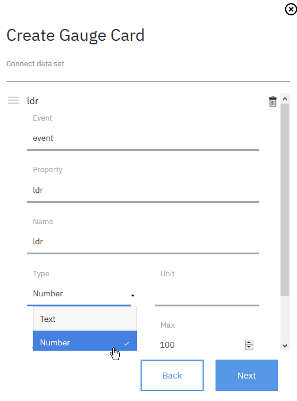
* Check that the type is `Number`
* Choose size and design of your gauge: 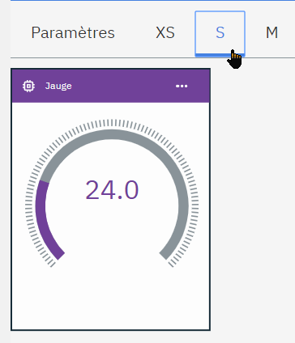

### Adding a multi-value graph

* Choose a card `Line chart`: 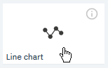
* Add two datasets, one for `ldr`:
  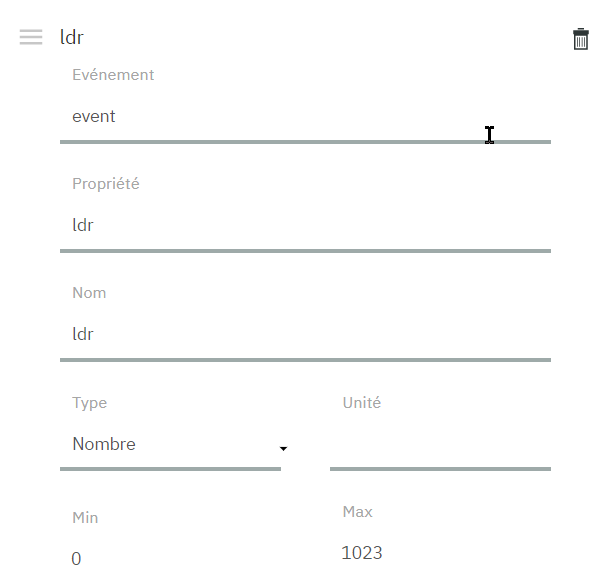 
* Another on for `solar`: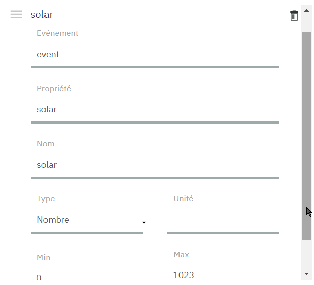
* Choose a size chart `L`: 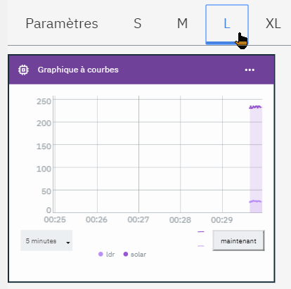
* The values of the two sensors will be displayed on the same diagram
  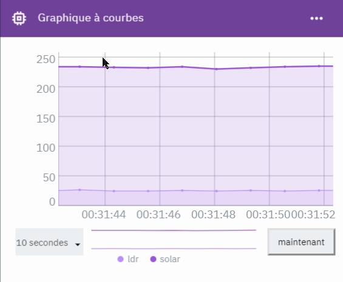

You can create maps for other sensor values.

# 2. Creating an interactive dashboard with Node-RED
We will now create a dashboard to act on the lamp. For this we will use Node-RED running as a WebApp on the IBMCloud.

## Starting Node-RED
* Return to the IBM Cloud Dashboard (https://console.bluemix.net/dashboard/apps)
* You must have an application running;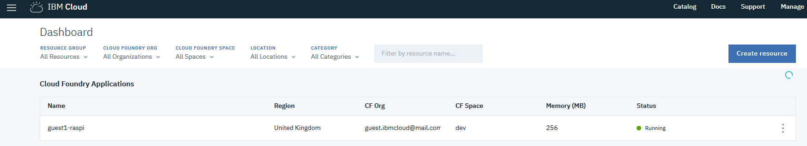Select it
* In the  `Routes` menu select the first one : 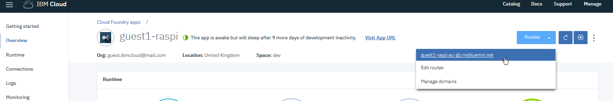
* The node-RED setup screen is displayed, click `Next` then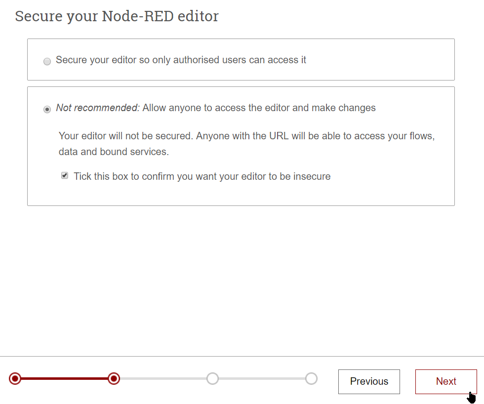 forcez la configuration non-sécurisée 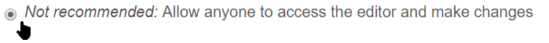 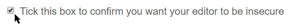
* Press `Next` and then `Finish`
* Finally, click 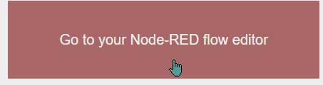, which opens the Node-RED flow editor.

## Creating a "send command" flow
*  `Flow 1` predefined does not interest us necessarily, we will create another thanks to the + top right; 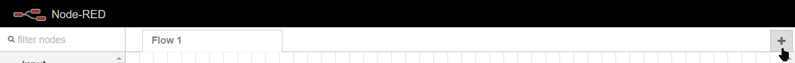

* From the palette on the left side of the screen, add a  `ibmiot` send node 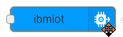. Warning, there are two similar nodes, this one has an entry on the left, and it comes from the drawer `output`

* Add an `Inject` node 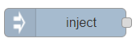 and wire them: 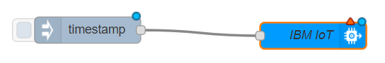

* modify the properties of the injected node to send a string of characters: 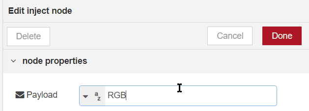
like RGB for instance

* Change`ibmiot` node parameters to match your lamp: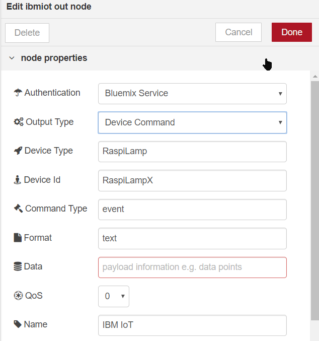
  * `Authentication` should be `Bluemix Service`
  * `Output Type` must be `**Device Command**`
  * `Format` must be `text`,

* Activation of the entry (left pellet of the node) 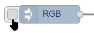 of the `inject` node should turn on your lamp.

* **Note that this interface is accessible from the internet** now, which was not the case in the first part.

## Adding a dashboard
### Setup
* From the menu at the top right, select `Manage Palette`: 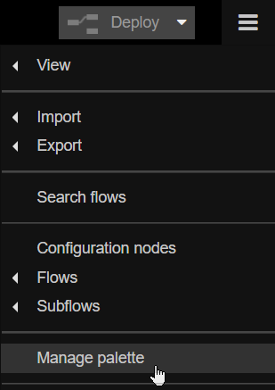

* Toggle on the tab `Install` 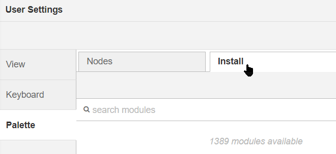

* Type `node-red-dash` in the search field 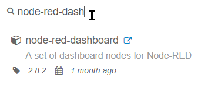

* Click on the `Install` button 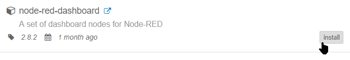 
This added a series of nodes in the left palette, under the category `Dashboard`:
 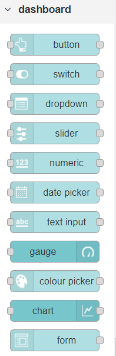

### Creating an interactive command dashboard
* From the palette, add  a `Text input` node and wire it to  `IBM iot`: 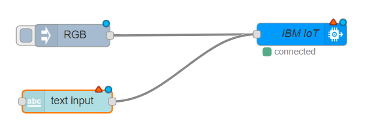

* Change node settings: Create a group: 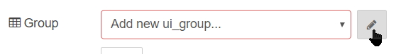
* Then a `tab` 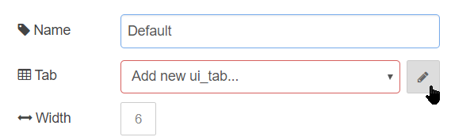 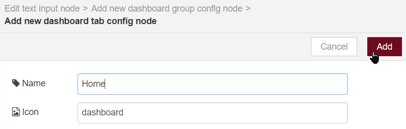
* Accept defaults or change names to your liking
* Validate and deploy, then click on the table launch from the new tab `dashboard` on the top right: 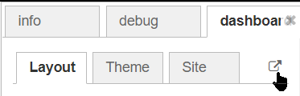

* The dashboard is displayed: 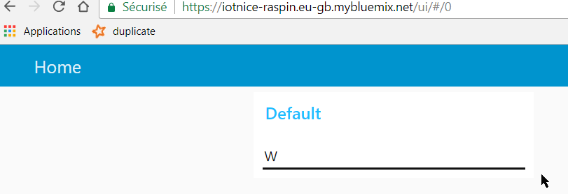
* You can now interactively change the color of the lamp by typing for example W or a sequence

### Adding gauges
We can decorate this dashboard of various displays:
* Add 3 nodes from the palette:
  * `ibmiot` with do on right 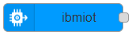 
  * `change` 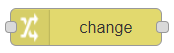
  * `gauge` 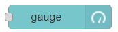

* Configure the nodes as follows:
  * `ibm IoT`, modify`Authentication`: 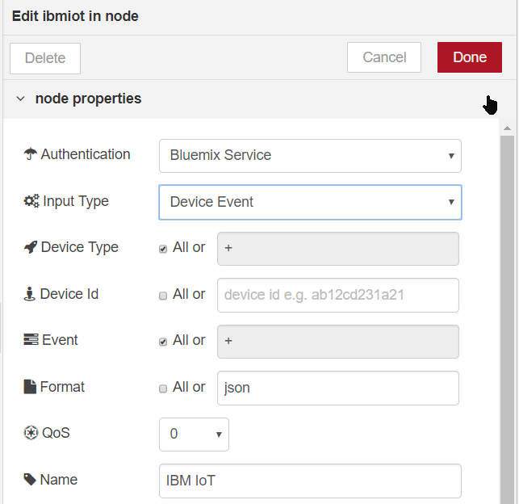
  * The  `change` node is used to extract the incoming message data to the  `gauge ` node format, we extract here the value of `ldr`: 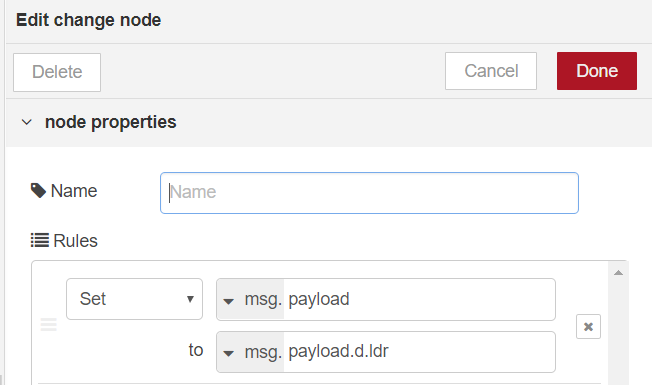
  * For the gauge, we will change the display limit: 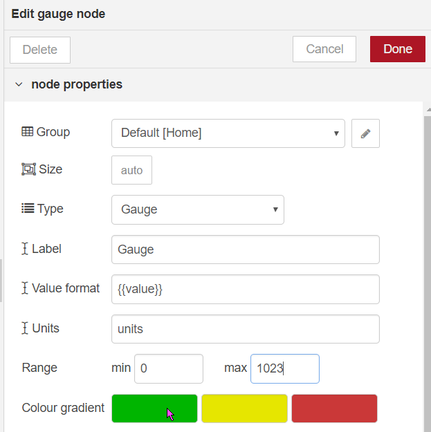

* Wire the nodes together: 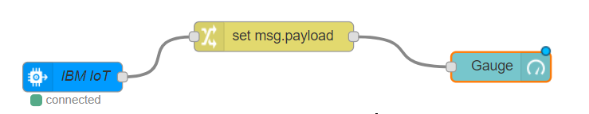then deplo 

* When we go back to the dashboard, we now see a gauge that changes when the sensor is more or less lit: 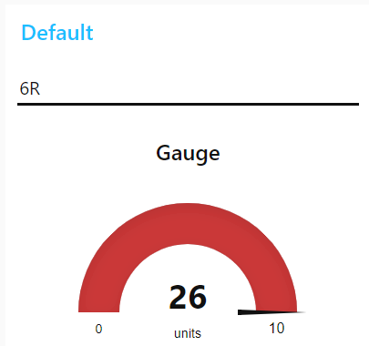

**This interface is now exposed directly on the internet**, you can connect to its public URL from a smartphone for example.

### Be creative!
You can change the dashboard at your convenience!

# 3. Control and automation of the SmartLamp
Last step, we will program a simple automation mechanism that changes the color of the lamp according to the ambient light level.

## Color change based on ambient light
* Add a `switch` node 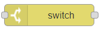and set it with the button `Add` 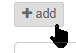as follow:  
* The node now has 3 outputs. Add 3 `change` nodes , and configure each one for a given R G B color:
* Wire as follow  and deploy

The lamp will change color depending on the illumination of the LDR sensor.

# 4. Lab Stretch Goal
For this section of the Lab, you will be tasked with a creating a more complex Dashboard, without precise instructions but just a functional and visual description, and a few hints.

The goal now will be to create a more elaborate dashboard, which will look like the following: 
* The line chart graph shows the value of both the `solar` and `ldr` sensors
* The set of buttons on the left will send a single W,R,G,B,0 command to the RaspiLamp
* The text entry below will send a command string when the `[Set]` button is clicked.
* The Clear button will reset the line graph
* The 4 dial gauges below will reflect the current value of the LEDs.

Implementation Hints:
* To set multiple values on the line graph, each sensor value must be passed in `msg.payload` with a `msg.topic` set to the sensor ID. You can use a `change` node for that, e.g.: 
* The LEDs colors are in the `d.leds`, as a WRGB field, with an octet for each element of the LED. You will need a `function` node with multiple outputs to split the LED colors into 4 outputs: 
* To clear the line graph, you must send it a `msg.payload` with an empty array:

## Be creative!
On this model, you can design different dashboards or automations loops variations to your liking!

# END of Lab 2