## Incomplete/outdated ML section for lab4 - need to use AutoAI

# [E] Machine Learning 

* Create a new model 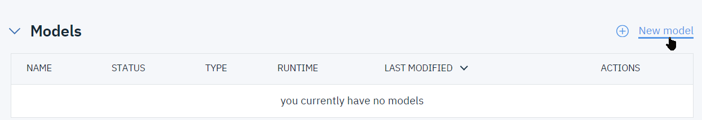

* Use any name, e.g. RaspiLampSolar 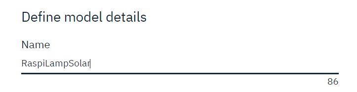
* Create a ML Service instance 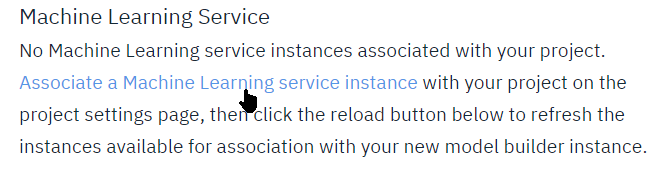
* Chose Lite plan: 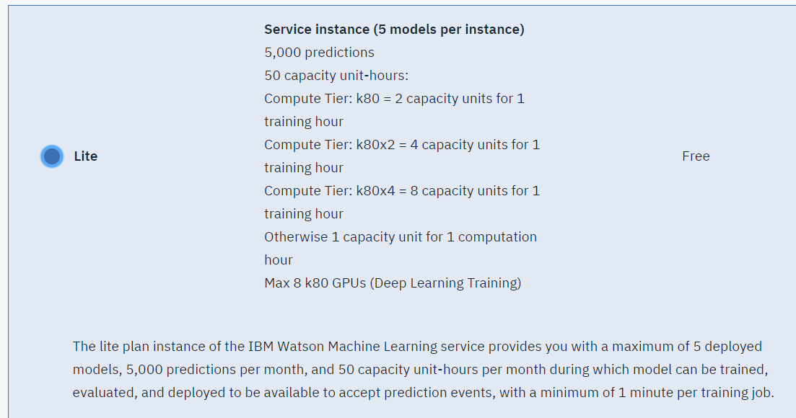
* Click `[Create]`,then `[Confirm]` defaults
* Click `reload` and select the newly created service

* Similarly, create a Spark Service: 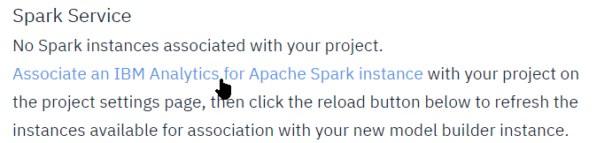

* Select Lite plan and click `[Create]`: 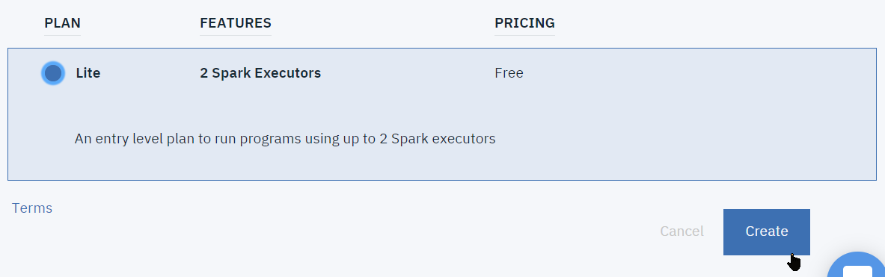
* Then in next panel `[Confim]` with defaults
* Back to the model creation panel, `Reload` and select the newly created Spark engine
* Select `Manual` model creation and click `[Create]`  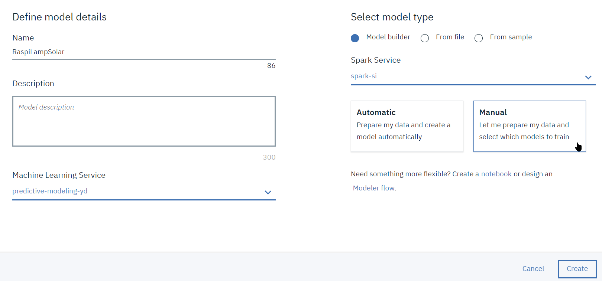

* On the next page, click `(+) Add Data Asset` 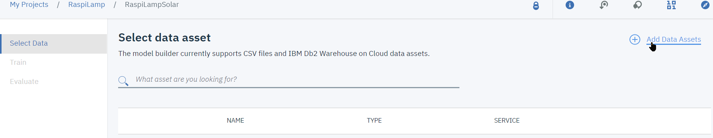

* There are ways to reference existing object storage files in a project's environment (using the `project-lib` library re: https://datascience.ibm.com/docs/content/analyze-data/project-lib-python.html), here we will simply download the `lampdata_All.csv` from object storage and upload it back to the project's file. Right click the `Services/Data Services` menu to open in a new tab: 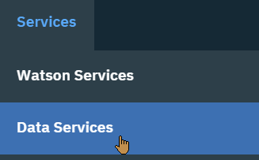
* Select and open your `cloud-object-storage-*` service, then click on `Manage` in the menu on the left.
* Navigate to the `raspilamp-20180420-x` bucket and open it.

* Type `lampdata_All` in the filter field, and then download the file to your laptop: 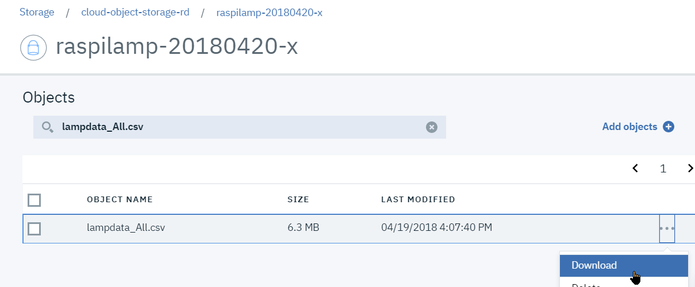.

* Back to the model creation page, open the files drawer on the right, and select the `Load` tab 

* Drop the `lampdata_All.csv` file there and wait for it to be uploaded 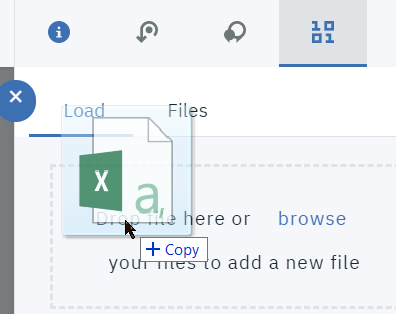

* Once done, select the file and click `[Next]`: 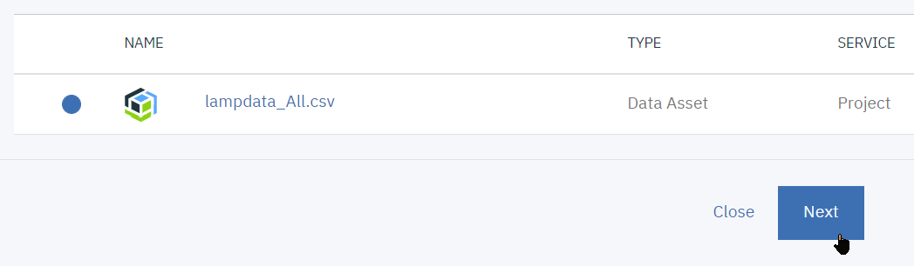
* If you are prompted to provision a new kernel, accept and proceed

* In the `Select a technique` screen, select `solar` as the value to predict, `ldr` as a feature column, Regression as the technique and click the `(+) Add Estimator`: 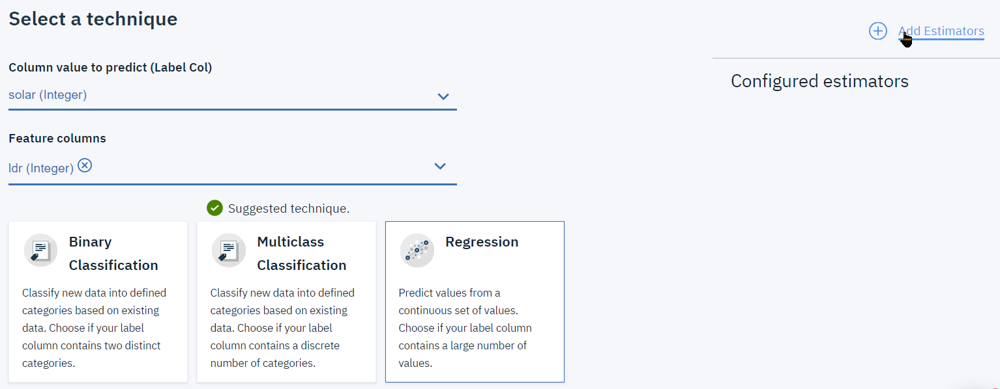

* Select and add `Isotonic Regression`: 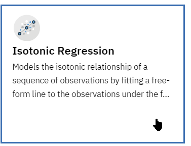

* Keep the 60-20-20 split of train/test/holdout, and click `[Next]`

* The model will start training, after a while you will be prompted to save it, acknowledge and proceed.

* Now switch to the `Deployments` tab:

* Click `(+) Add Deployment`: 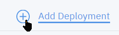

* We will add a Web Service deployment which will expose a REST API for scoring. Name it e.g. `WS_raspilamp` and click `[Save]`: 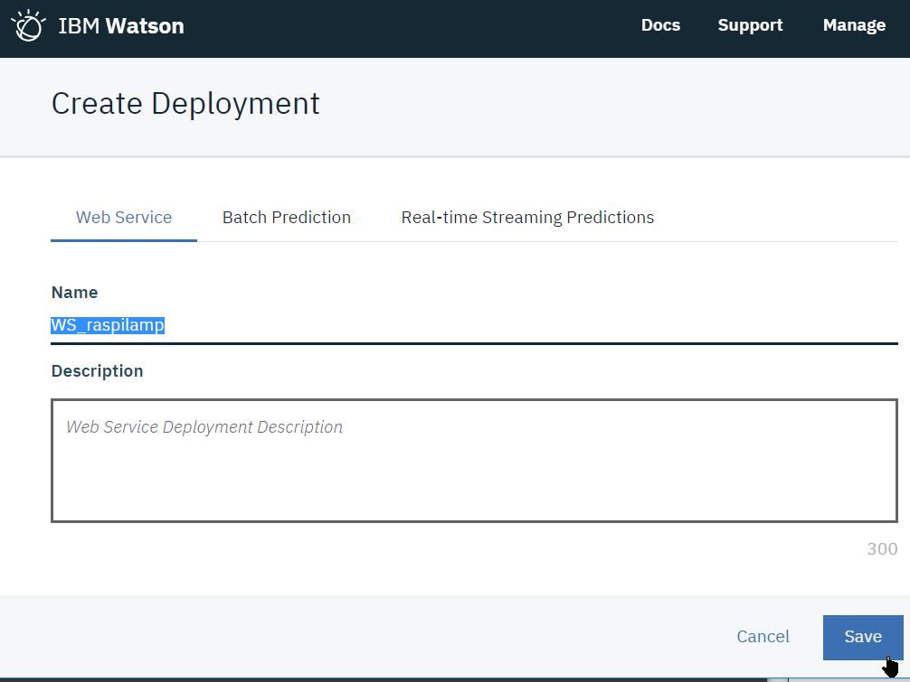

* Once deployed select View from the Actions menu: 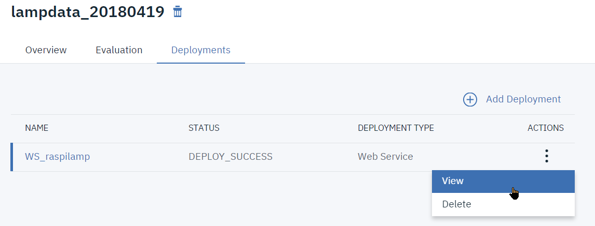

* Switch to the `Test` tab, enter values (all zeros except for the `ldr` which should be in the 0-1023 range), and click `[Predict]`: 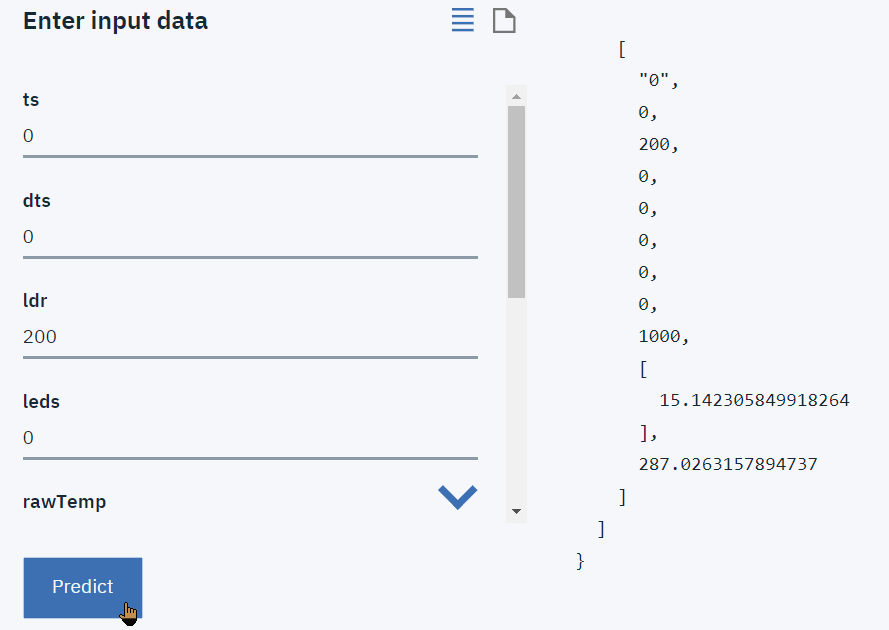
* The predicted value for `solar` will be displayed

This concludes the scripted part of the Hands-On Lab

# [Z] Hands-on Stretch Targets
The following suggestions to go beyond are not scripted and left to your creativity in terms of implementation:

1 Generate data from the lamp with anomalies, e.g. points where `LDR` and `solar` do not receive the same light and thus are not on the curve.
2. Use clustering technique to classify the dots as normal or anomalous
3. Export this to a file with the class column
4. Train a model to predict the class from the ('ldr','solar') value
5. Use the python REST invocation API of the deployed service from a Notebook to score the contents of a CSV file.
6. Add this to the Streams flow to classify anomalies in real time