# Smart Lamp and Watson Vision - Optional Lab

## Introduction

These practical exercises are intended to illustrate how to integrate Artificial Intelligence capabilities of the IBM Watson & Cloud platform to your IoT project. 

The idea of this optional lab is to use the camera of the device (in our case, the camera of the Raspberry Pi)  to detect event that will have an influence on the Smart Lamp. As a demo, we will change the color of the smart lamp leds when the camera detect a person.

 We will use a cloud service called Visual Recognition and the default faces detection model.

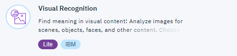

Like all Watson services, it can (and probably should) be trained to detect your specific requirements.  If interested, contact the instructor for a demo.

## Creation of a Visual Recognition instance

First, you need to create an IBM Watson Visual Recognition service instance.

Go to the IBM Cloud catalog, and select the Watson category (or follow this link https://console.bluemix.net/catalog/?search=label:lite&category=watson )

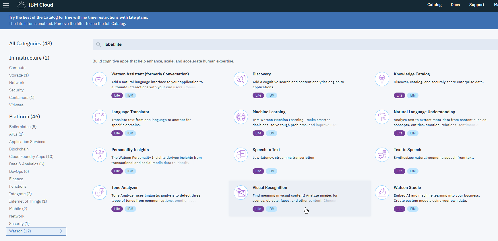

Click on Visual Recognition. On the next screen, give a unique name to your service such as `Visual Recognition-LampX`  where X is the number of your lamp and then click on `Create` at the bottom right of the page

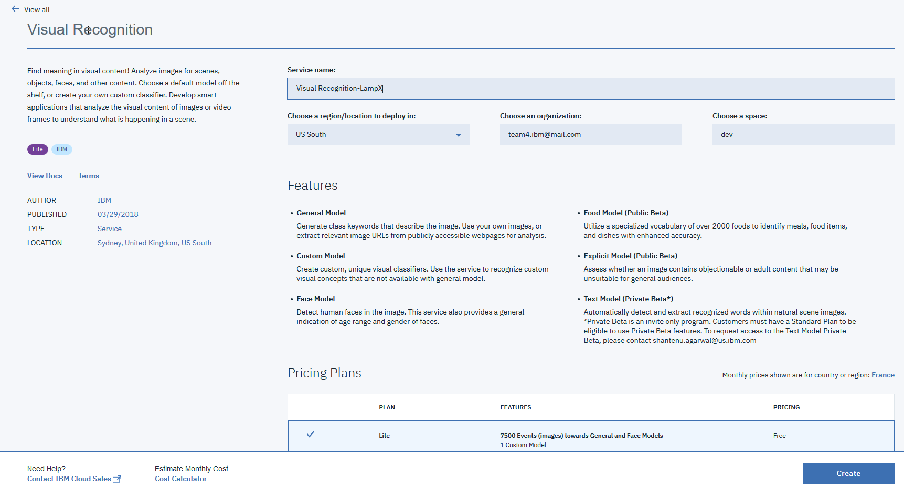

You can test the Visual Recognition service by clicking on `Launch tool` button.

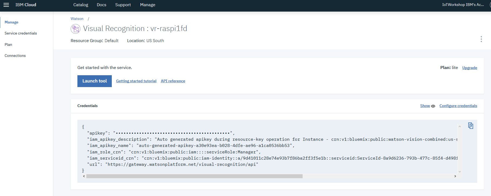

Click `Continue` on the next screen (it also create an instance of Watson Studio if not already done) to manage custom models) : 

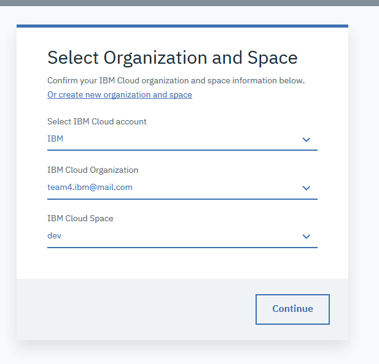

Then `Get Started` :

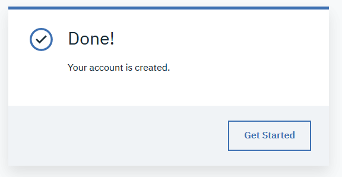

First usage of an instance of Visual Recognition takes a few minutes :

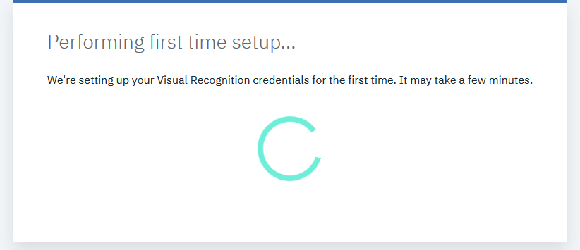

When the service is ready to use, you reach the following page on which you can test the various models interactively.

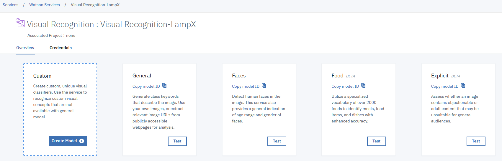

## Include Visual Recognition in Smart Lamp

We will create a new flow in the Node-RED instance running on the Raspberry PI. 

To get the IP adress of your Raspberry PI, click on the small joystick near the ethernet port. The IP address will scroll on the display.

Access your Raspberry Node-RED instance from your web browser using the on 1880 port i.e. http://<<YOUR-IP-ADDRESS>>:1880/

Create a new flow by clicking on the `+` button

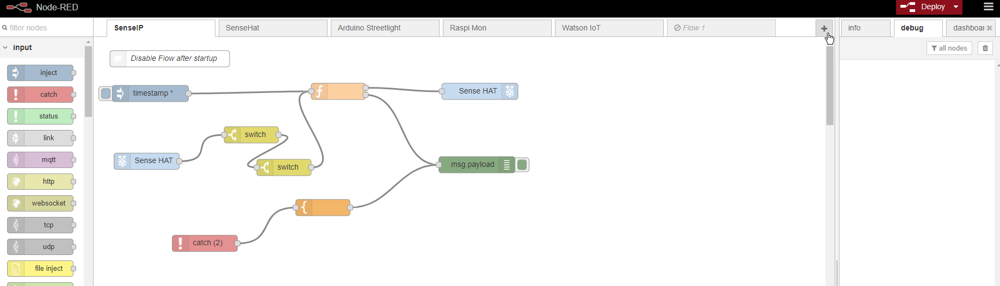

Double click on the flow tab (on the name) to change tab name to `Visual Recognition`

We need to add Watson nodes to Node-RED to invoke easily IBM Watson services without having to deep dive into the API documentation.

To add, Watson nodes, go to `Manage Palette`

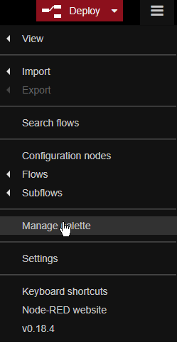

Select `Install` tab and enter `Node-Watson` in the search field, then `install` button on the right of th node-red-node-watson line.

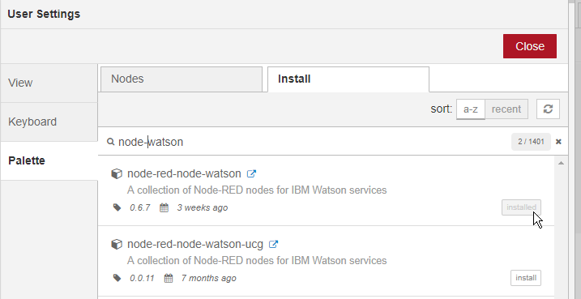

We need also to install a node to handle the Camera connected to the PI.

In `Manage Palette`, install `node-red-contrib-camerapi` nodes : 

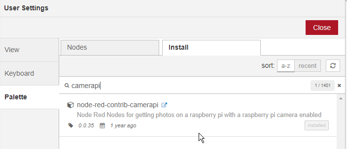

The program (or flow) that you will create looks like the following one. 

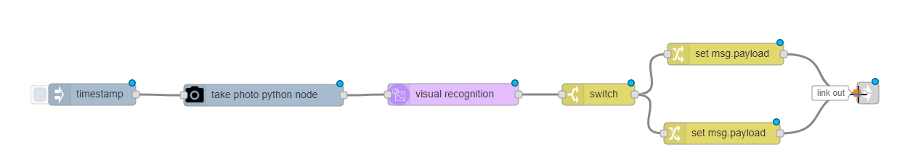

First we trigger the flow on a regular bases using an `inject ` node available in `input` drawer. The payload is not important, and we will repeat the trigger every 5 seconds to detect any changes in front of the camera.

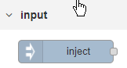 - 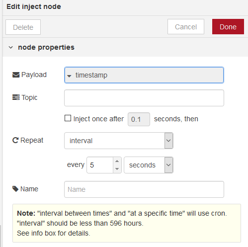

Next step of the flow is to take a picture with the `camerapi` node available in the `Raspberri Pi` drawer. As we don't need to store the picture taken locally on the Raspberri Pi, we can use the `Buffermode` to pass a buffer directly to the next node (Visual Recognition)

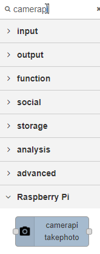 - 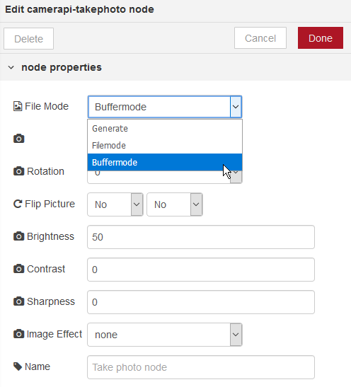

The next node is the `visual recognition` node found in the `IBM Watson` drawer. To identify which IBM Cloud Visual Recognition service, you need to put in the API Key of the service you have created before.

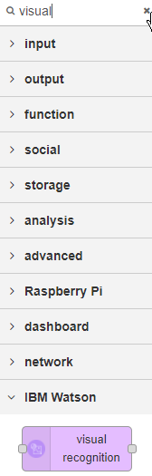 - 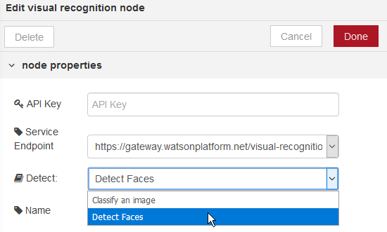

Make sure that  "Detect Faces"  for the `Detect field`, and the "https://gateway.watsonplatform.net/visual-recognition/api" for the `Service Endpoint`. For your information, the other Service Endpoint option is for backward compatibility purpose (for older instances of Watson Visual Recognition).

To find the requested API Key, go to your IBM Cloud Dashboard, https://console.bluemix.net/dashboard/apps/, and click on the visual recognition service.

Click on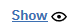(`Show`) link to display and copy the `apikey` field.

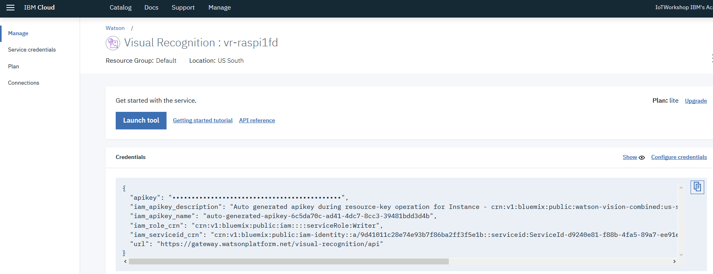

Paste the copied `apikey` value in the `API Key` field of the Visual Recognition node properties.

For information , you can create several credentials on the same service for different applications in the `Service Credentials` part of the service.

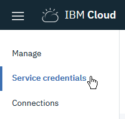

Now we need to process the results of the call to the Watson Visual Recognition service. The data returned by the API call are available in `msg.result`.  For your information, use a `debug` node to discover the structure of the returned `msg.result` JSON object.

We use the `switch` node in the `function` drawer to check the number of faces detected by Visual Recognition. If the number of faces is not null, we want to turn the light on to green. Otherwise, we want to turn it on to red. 

The `Property` to test is : `msg.result.images[0].faces.length`

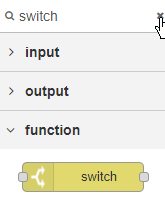 - 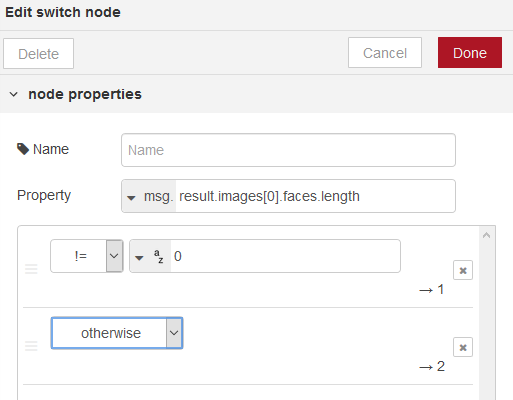

After the switch node, we have to path for the flow, one in case there is faces on the pictures, one if there is no faces. We can now do any processes based on result information. In our case, we want to set the color of the street lamp. We use a `change` node on each branch  to modify the `msg.payload` value to "G" or "R" depending on the path.
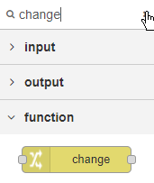 - 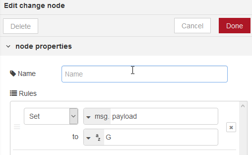
The msg is now sent to the lamp using a `link` node located in `output` drawer. This node helps to clarify the understanding of the flows by separating them in various tabs.

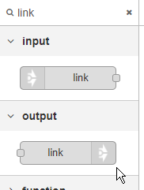 - 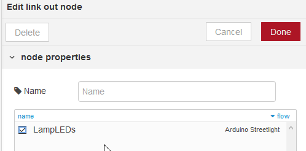

Now you can deploy your code by pushing the deploy button on the top right of the screen.

You should see the lamp turning RED or GREEN depending on the face detection. By using a `debug` node you can have a deeper understanding of the results and the value provided by Watson Visual Recognition service.

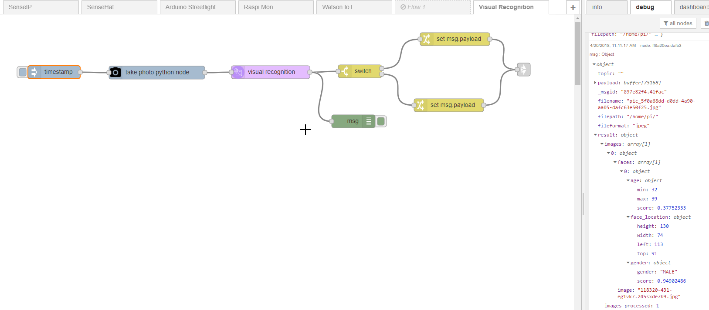

As an optional exercice, you can develop a simple page with node-red to display the picture taken by the raspberry. 

Hint : 

- You will need to save the picture taken by the camera as a file (because the image is not persisted when using an imagebuffer) , and load the file to send it to Visual Recognition.