# Smart Lamp Lab

## Introduction
These practical exercises are intended to illustrate the use of so-called 'intelligent' urban devices, which beyond their primary function, also include communication, telemetry and action capabilities.

## Description of hardware device
The equipment available represents in a reduced model what could be a 'smart street street lamp'.

The device consists of a Raspberry Pi 3 minicomputer, connected to an Arduino Uno microcontroller.

The Raspberry Pi 3 is connected to the internet and the Cloud via a Wi-Fi connection, and will represent the heart of the intelligence of the communicating system.

The Arduino Uno is used as a measuring system.

The primary function of the street lamp is of course to illuminate by means of a source of light, which will be simulated here by a bar of 5 controllable LEDs.

The device is also equipped with a brightness sensor implemented by a LDR (Light Dependent Resistor), and a miniature solar panel, connected to the Arduino and relayed by the Raspberry to the Cloud.

The Raspberry Pi itself has environmental sensors whose values ​​are added to the feedback of the lamp to the cloud.

## Goal of the lab
The proposed exerices are intended to illustrate how an intelligent street light would behave, firstly to allow tracking of environmental data, but also to implement 'intelligent' behaviors via programmable automatisms, or to propose new functionalities.

## Organisation
1. These exercises are broken down into 6 sections:

  1. Getting started and simple connectivity to the cloud and plotting the data collected by the sensors.

  2. Create an account on the IBM Cloud Watson IoT platform.

  3. Connecting the SmartLamp to the IoT platform, defining and cataloging devices

  4. Create a dashboard to view the data.

  5. Creation of an interactive dashboard to control the lighting of the lamp.

  6. Creation of an automatic lamp control mechanism.

     Z. Bonus: color spread from one group to another

# 1. Getting started and connectivity

For the exercise, the lamps are connected on the internet via the Raspberry Pi.

A control software, called gateway runs on the Raspberry Pi and has the role of relaying the measurements taken by the sensors connected to the Arduino to the cloud.

This Control software is developed thanks to a visual programming environment, open-source, Node-RED.

Node-RED can run on a variety of hardware types, from linux Single Board Computers such as Raspberry Pi to Cloud Environments.

The Node-RED program running on the gateway has been installed for you, but will require a configuration specific to your Cloud connection.

## Setting up the Node-RED gateway
### Accessing Raspberry's Node-RED
Node-RED is programmed through a web interface accessible from your laptops.

To get the IP adress of your Raspberry PI, click on the small joystick near the ethernet port. The IP address will scroll on the display.

Access your Raspberry Node-RED instance from your web browser using the on 1880 port i.e. http://<<YOUR-IP-ADDRESS>>:1880/

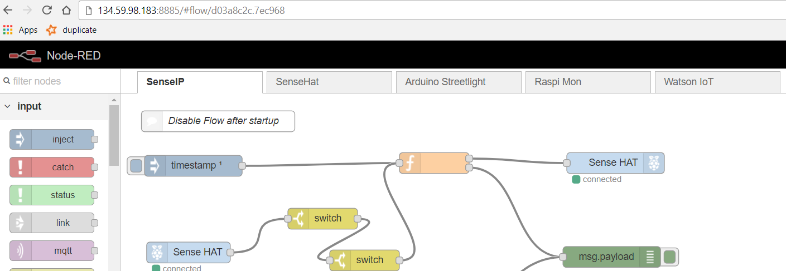

### Configuring the gateway to send sensor's data on the cloud
The different tabs are programs (flows) that implement a functionality of the gateway. For example, the first tab, `SenseIP`, displays the IP address of the Raspberry on the LED display at system startup.

We will focus on the `Watson IoT` tab which is in charge of transmitting the sensor data to the Cloud:
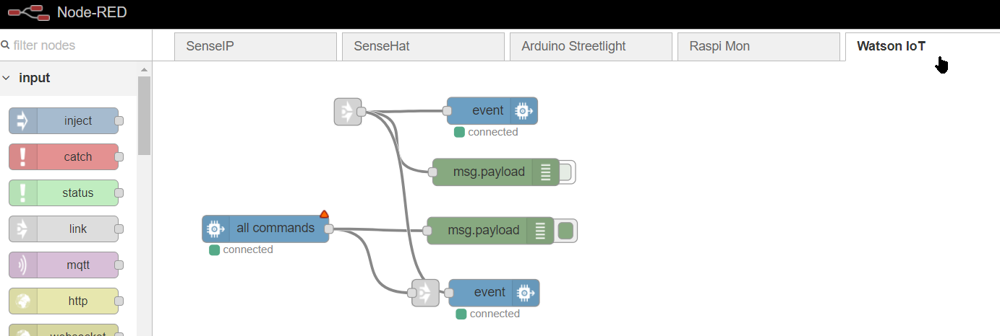

* Locate the `event` node at the top of the diagram, and double-click on it to open its parameters:
  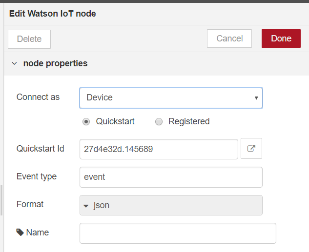

* If not already done, select `Device` and `Quickstart`. An identifier must be filled in the `Quickstart Id` field. This identifier is used to recognize the different devices connecting to the Watson IoT platform on IBM Cloud.

* Click on `Done` and once back on the 'flow', on the button `Deploy` on the top right:

* the status of the `event` node should indicate `connected` preceded by a green dot:

  

* We will now be able to view the sensor data on the test cloud environment. Reopen the properties of the `event` node by double-clicking on it and select the button to the right of the field `Quickstart Id` . This opens a new tab where the sensor data is displayed:
  

* The first field that is plotted is `ts` which is a record of time, so it is normal for it to evolve linearly.

* Navigate to the bottom of the screen and select another field, for example `solar` or `ldr`: 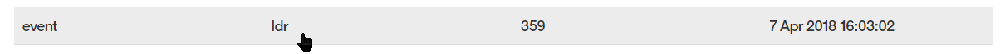the measurement graph is displayed and you can influence on the sensors (`ldr` or `solar` solar panel) by passing your hand in front to see the variation of the values on the graph.

  Raspberry equipped with a SenseHat (all except number 0) also have a record of temperature, humidity, pressure. One can act on the temperature or humidity by blowing on the sensors. 

* You can also access the plot from for example the browser of your mobile phone.

This illustrates how to connect a sensor to a cloud data collection system.   

## Control of the lamp LEDs from the Raspberry Pi
The Raspberry Pi has been set to send a lighting sequence to the lamp. We will first test this mechanism from Node-RED on the Raspberry Pi:

* Return to Raspberry Pi's Node-RED web interface, and navigate to the tab  `Arduino Streetlight`: 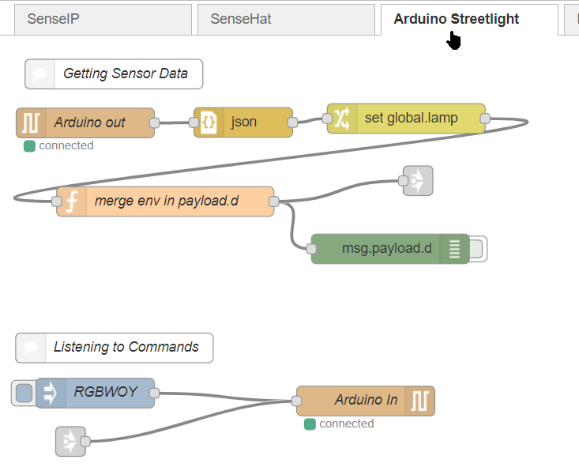
* The sequence at the bottom of this flow makes it possible to send a command to the lamp. The lamp includes codes to light its various colors, R for Red, B for Blue, G for Green, 0 to 9 for various intensities of White, etc. Click on the pellet to the left of the button `RGBWOY`: 
* The lamp will light in sequence with the colors Red, Green, Blue, White, Orange, Yellow
* By double-clicking on the RGBWOY node, you can modify the parameters and the sequence that will be sent, for example `W9753RGB0`: 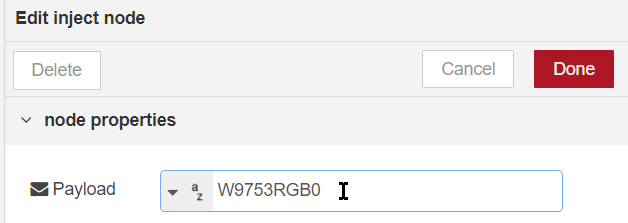 N'oubliez pas de validate the changes by clicking on the button `Deploy` 

# 2. IBM Watson & Cloud account creation Introduction
For the moment, we can only plot a few data points on a single sensor at a time, we will now set up a more specific system on IBM Cloud and Watson IoT allowing multiple values to be taken into account simultaneously and to compose a display more A privileged.

To do this, you must first register on the IBM cloud.

## Create an IBM Cloud Account
We will use the shortcuts provided in the screen `QuickStart`.

* Go back to https://quickstart.internetofthings.ibmcloud.com/#/device/27d4e32d.145689/sensor/ and click on the 'CREATE APP' button: 

* Click on the button `Sign up to Create` on the bottom right: 

* On the next screen, enter your email (or alias), Last Name, First Name and Password.

* IMPORTANT : Specify `United States` as country to be able to use beta features of IBM Cloud.

  

* Then click on  `Create Account` 

  ​

* 

* A confirmation email should be sent shortly, entitled `Action required: Confirm your IBM Cloud account`. Follow the instructions in this message to validate your account on IBM Cloud.

* After having confirmed the creation of the account, 
  proceed to login : 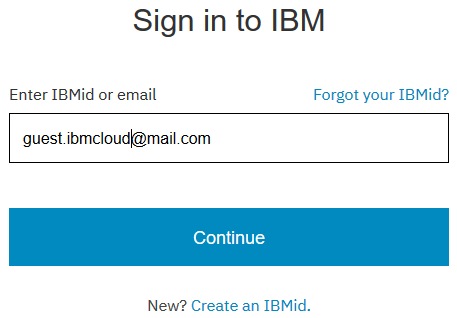

## Creating a Watson IoT platform instance
From the home screen 
Click on 

In the filter field, type `iot`: 
Then in the `Boilerplate`:
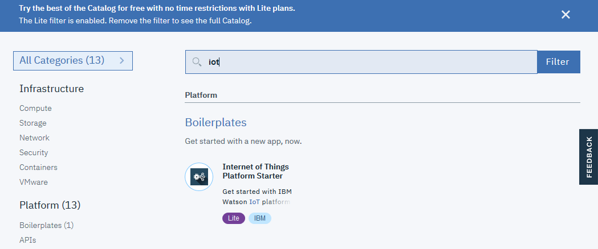

Choose a unique name, for example `guest1-raspi`, keep the default for the other fields

the clck on  `Create` 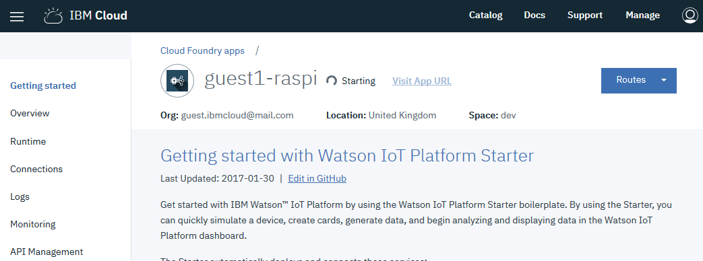

Then wait for the platform to start

# 3. Connecting the SmartLamp to the Cloud Infrastructure
We will now connect the SmartLamp to the Watson IoT platform we created in the previous step.

To do this, we will change the login credentials on the Raspberry Pi, and create a definition for the SmartLamp in Watson IoT platform.

## Access to the Watson IoT platform
We will define the deivce type `SmartLamp` in Watson IoT so that we can then use it:

* In IBM Cloud, access the dashboard from the menu at the top left: ,   

* then select `Dashboard`: 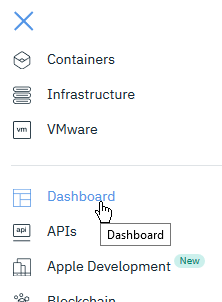

* locate the Internet of Thing platform service: 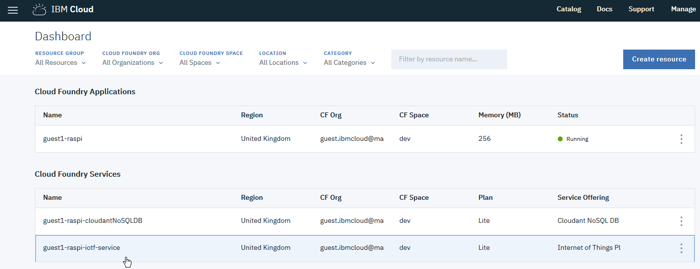 and select it

* On next screen, click on  `Launch`: 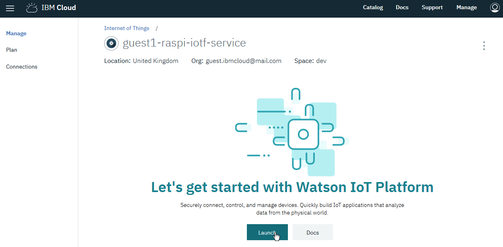

You should arrive on the management console of your Watson IoT Plateform:

## Changing security settings
As this is an exercise, we will allow a simpler configuration of the security requirements of the terminals, by disabling the obligation to have SSL encrypted communications.

* Select  `Security` entry in the menu 

* Edit Connection Security parameters: 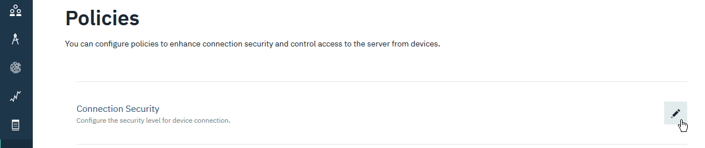

* Select `TLS Optional` in the security level for scope `default `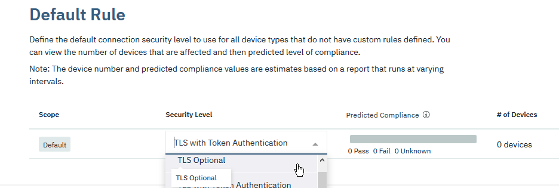   

Click on OK on the Warning message 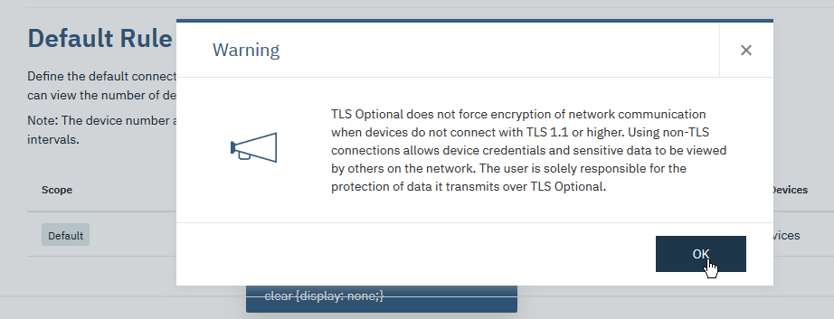And on the `Save`  button located at the top right postion 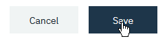

## Creating the lamp definition
The lamp sends structured data in a JSON format with attributes corresponding to the values recorded by the various sensors.

Here we will only have one system, but in a real deployment, there may be many different types of hardware (called devices), and you have to tell the cloud platform what these devices are to be able to manage them according to their type.

* Access the terminal management menu: 

* There is normally no terminal defined at this point, click on `Add Device` button on the top right position  to add a new device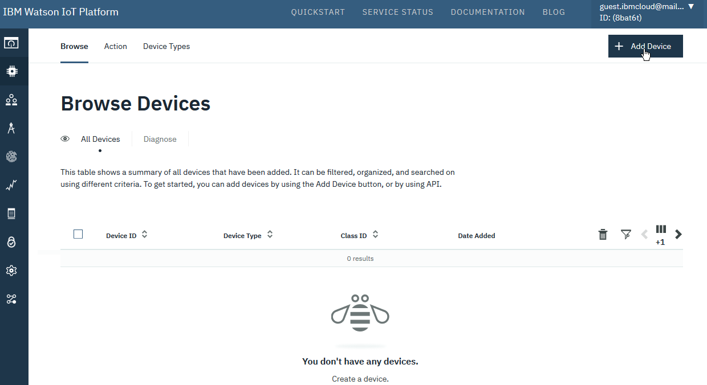 

* Select  `Device Types` tab , then `Add Device Type` 

* Enter device type name `RaspiLamp`, and an optional description: , then on the `Next`  button.

* You can optionnaly add information on the  `Device Information ` tab and validate by pushing the `Done` on the bottom right 

* On the next screnn, select `Register Divces`, then enter `RaspiLampX` as name where  `X` is the number of your lamp., then push the `Next` button.

* Click`Next` until  `Security` tab, in the  `Authentication Token`, enter a value that you can easily remember such as the same name as your lamp, i.e. `RaspiLampX`:  
  This token is in fact the password of the terminal and will be used to connect it to the platform in a secure way.

* Click`Next`until the last page and then `Done`  
  Please take note of your Organization ID :

  

## Registration of your streetlamp on your Watson IoT organization 
We will now modify the characteristics of the lamp connection in the Raspberry Pi to connect to this organization and to use the lamp data.

### Configuring sending data to Watson IoT
* Switch to another tab or window of your browser on the Node-RED interface of your lamp at the address 

  (Remember : To get the IP adress of your Raspberry PI, click on the small joystick near the ethernet port. The IP address will scroll on the display)

  Access your Raspberry Node-RED instance from your web browser using the on 1880 port i.e. http://<<YOUR-IP-ADDRESS>>:1880/

* Select `Watson IoT`  tab the open  `event`  node properties

* Check that `Connect as` is set as `Device`, and select the radio button `Registered` 

* The next line changes to  `Credentials`, and click on the edit button on the right 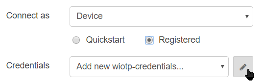 and enter connection parameters of your lamp (Organization, Device Type, Device ID and Auth Token)
  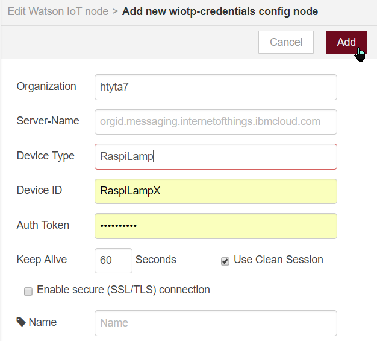

  then click the `Add` button on the top right

* Click on `Done`    
  then click on  `Deploy` for the changes to be taken into account.

* The dot color of the node should briefly turn yellow or green, then go green:
  The new lamp is now connected

### Configuring reception of commands
In the same way, we will reparametrer the node which receives the commands of the platform Cloud Watson IoT.

* Open the properties of the node`all commands` 

* Change `Conect as` to `Device` and select the credentials from the menu: 

  then click on `Done`

* After clicking on `Deploy`, the node dot goes red and then green

### Verification on the Watson IoT platform

* Return to the Watson IoT tab, select `Devices`  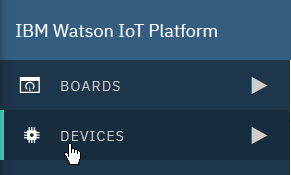

  the line of the lamp must have a green dot on the left: 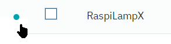

* Selecting the `RaspiLampX` line the  `Recent Events` tab, we see the data arrive:

* 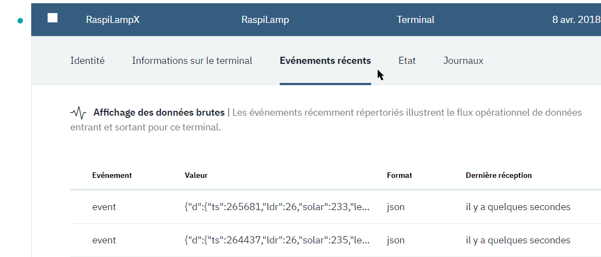

### Definition of a data type
Now that the sensor is plugged in, we will be able to introspect it to know its data format

* Return to the  `Devices` section, then select the type RaspiLamp and finally the tab `Interface` 

* Select`Create Interface` 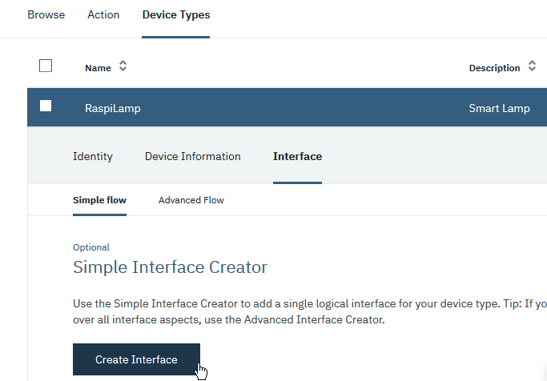, the events that have arrived make it possible to know which attributes exist, then`Add Property` 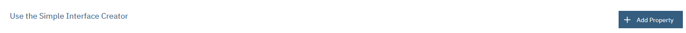

* Select `d`  and then `Next`

* Finaly the `Add` button: , and then validate by pushing `Done` 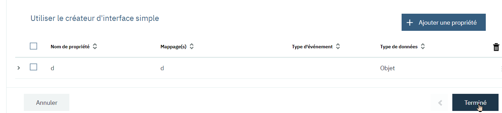

# 4. Creating a dashboard
We will now create a graphical interface to plot the data of the various sensors of the lamp.

* Select  `Dashboard` menu 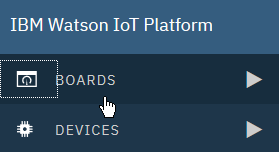

* Click on the big empty rectangle to add a table 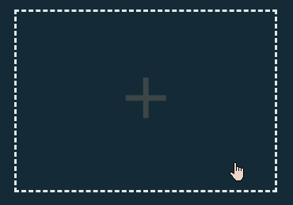

* remplir les données    
  then `Next` and `Submit`

* Open the newly created table: 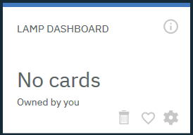

* Click `Add New Card` to add items to the table 

### Adding a gauge
* For example, add a brightness gauge 
* 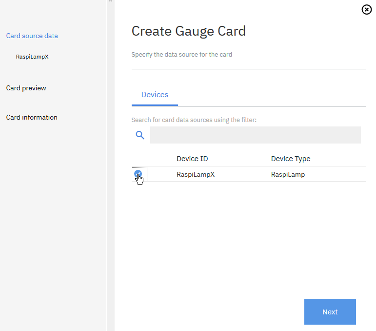
* 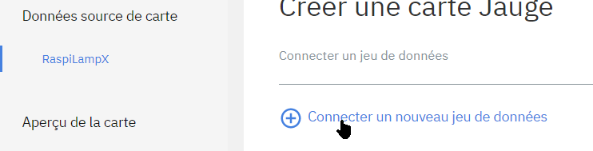
* 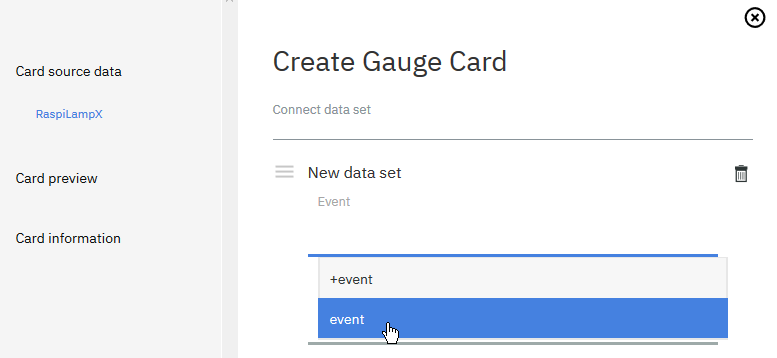
* 
* Check that the type is `Number`
* Choose size and design of your gauge: 

### Adding a multi-value graph

* Choose a card `Line chart`: 
* Add two datasets, one for `ldr`:
  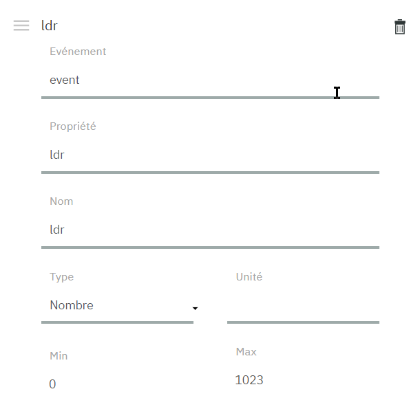 
* Another on for `solar`:
* Choose a size chart `L`: 
* The values of the two sensors will be displayed on the same diagram
  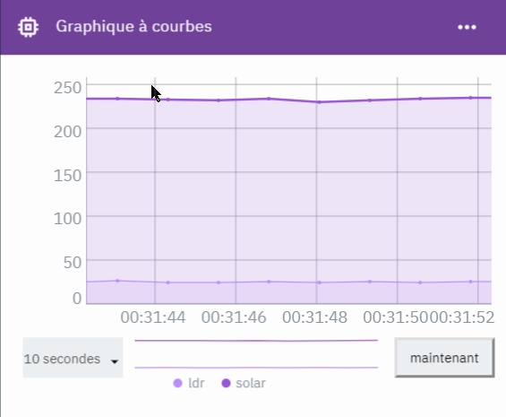

You can create maps for other sensor values.

# 5. Creating an interactive dashboard
We will now create a dashboard to act on the lamp. For this we will use Node-RED, but on the Cloud.

## Starting Node-RED
* Return to the IBM Cloud Dashboard (https://console.bluemix.net/dashboard/apps)
* You must have an application running;Select it
* In the  `Routes` menu select the first one : 
* The node-RED setup screen is displayed, click `Next` then forcez la configuration non-sécurisée  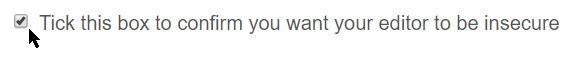
* Press `Next` and then `Finish`
* Finally, click , which opens the Node-RED flow editor.

## Creating a "send command" flow
*  `Flow 1` predefined does not interest us necessarily, we will create another thanks to the + top right; 

* From the palette on the left side of the screen, add a  `ibmiot` send node . Warning, there are two similar nodes, this one has an entry on the left, and it comes from the drawer `output`

* Add an `Inject` node  and wire them; 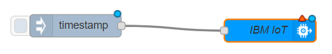

* modify the properties of the injected node to send a string of characters: 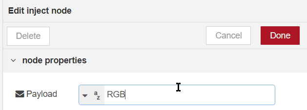

  like RGB for instance

* Change`ibmiot` node parameters to match your lamp:
  * `Authentication` should be `Bluemix Service`
  * `Output Type` must be `**Device Command**`
  * `Format` must be `text`,

* Activation of the entry (left pellet)  of the `inject` node should turn on your lamp.

* **Note that this interface is accessible from the internet** now, which was not the case in the first part.

## Adding a dashboard
### Setup
* From the menu at the top right, select `Manage Palette`: 

* Toggle on the tab `Install` 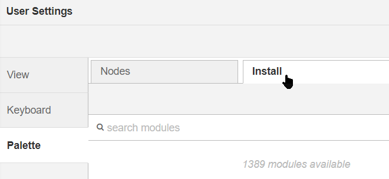

* Type `node-red-dash` in the search field 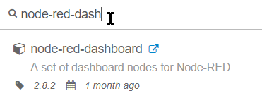

* Click on the `Install` button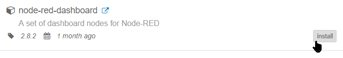

  Then confirm the installation

This added a series of nodes in the left palette, under the category `Dashboard`:

 

### Creating an interactive command dashboard
* From the palette, add  a `Text input` node and wire it to  `IBM iot`: 

* Change node settings: Create a group: 
* Then a `tab` 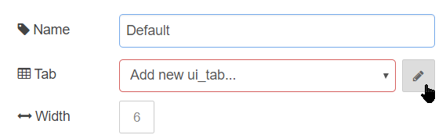 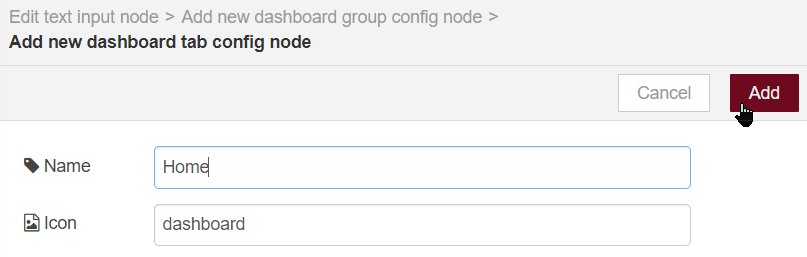
* Accept defaults or change names to your liking

* Validate and deploy, then click on the table launch from the new tab `dashboard` on the top right: 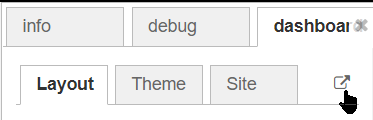

* The dashboard is displayed: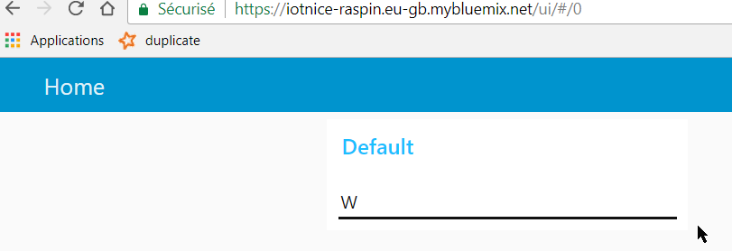
* You can now interactively change the color of the lamp by typing for example W or a sequence

### Adding gauges
We can decorate this dashboard of various displays:
* Add 3 nodes from the palette:
  * `ibmiot` with do on right  
  * `change` 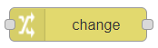
  * `gauge` 

* Configure the nodes as follows:
  * `ibm IoT`, modify`Authentication`: 
  * The  `change` node is used to extract the incoming message data to the  `gauge ` node format, we extract here the value of `ldr`: 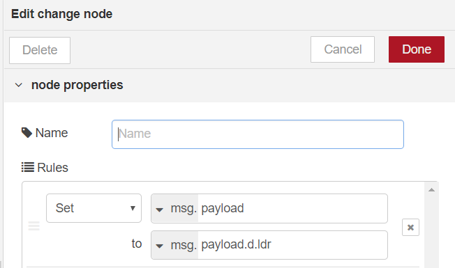
  * For the gauge, we will change the display limit: 

* Wire the nodes together: 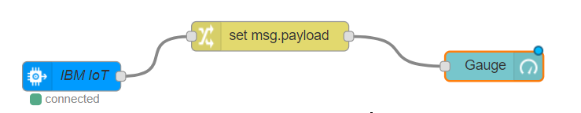then deplo 

* When we go back to the dashboard, we now see a gauge that changes when the sensor is more or less lit;

   

**This interface is available on the Cloud**, you can connect to it from a smartphone for example.

### Be creative!
You can change the dashboard at your convenience!

# 6. Contrôle et automatisme de la SmartLamp
Last step, we will program a simple automatism that changes the color of the lamp according to the brightness.

## Color change according to brightness
* Add a  `switch` node 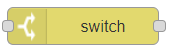and set it with the button `Add` 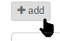as follow:  
* The node now has 3 outputs. Add 3 `change` nodes , and configure each one for a given R G B color: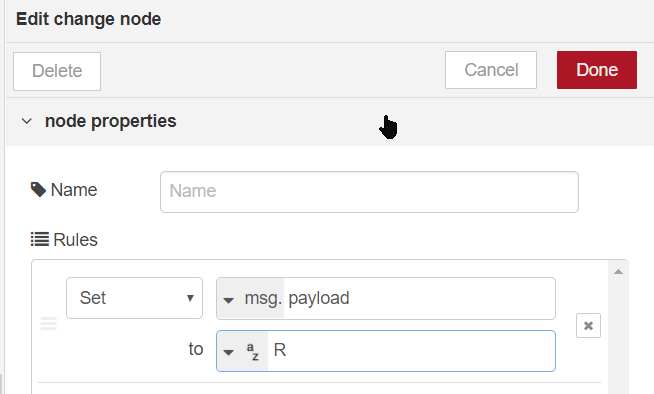
* Wire as follow  and deploy

The lamp will change color depending on the illumination of the LDR sensor.

## Be creative!
On this model, you can design different variations to your liking!

# END

